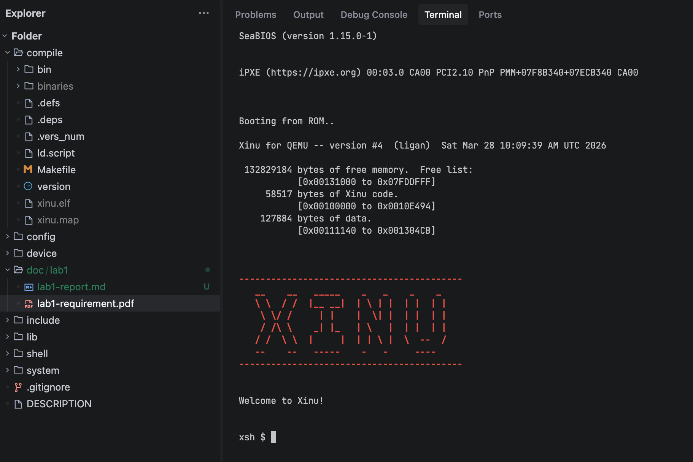
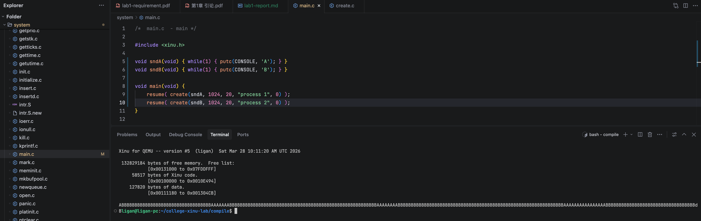

# 实验 1 实验报告

李甘 2023202296

说明：由于这个实验的要求文档足够清晰且内容较简单，所以我没有使用任何 AI 工具。

## 步骤一：不修改代码，编译并运行 Xinu

编译：

```plain
ligan@ligan-pc:~/college-xinu-lab/compile$ make clean
removing .o files
removing configuration files ...
make[1]: Entering directory '/home/ligan/college-xinu-lab/config'
rm -f config lex.yy.c y.tab.c
make[1]: Leaving directory '/home/ligan/college-xinu-lab/config'
removing xinu ...
ligan@ligan-pc:~/college-xinu-lab/compile$ make > /dev/null 2>&1
ligan@ligan-pc:~/college-xinu-lab/compile$ ls
bin  binaries  ld.script  Makefile  version  xinu.elf  xinu.map
ligan@ligan-pc:~/college-xinu-lab/compile$
```

运行：



## 步骤二：修改 main.c 并运行和调试

修改 main.c：

```c
/*  main.c  - main */

#include <xinu.h>

void sndA(void) { while(1) { putc(CONSOLE, 'A'); } }
void sndB(void) { while(1) { putc(CONSOLE, 'B'); } }

void main(void) {
	resume( create(sndA, 1024, 20, "process 1", 0) );
	resume( create(sndB, 1024, 20, "process 2", 0) );
}
```

为理解`create(sndA, 1024, 20, "process 1", 0)`中 1024 20 0 的含义，我查阅了 create.c：

```c
/*------------------------------------------------------------------------
 *  create  -  Create a process to start running a function on x86
 *------------------------------------------------------------------------
 */
pid32	create(
	  void		*funcaddr,	/* Address of the function	*/
	  uint32	ssize,		/* Stack size in bytes		*/
	  pri16		priority,	/* Process priority > 0		*/
	  char		*name,		/* Name (for debugging)		*/
	  uint32	nargs,		/* Number of args that follow	*/
	  ...
	)
```

接着，我编译运行了上述程序。与预期一样，我看到屏幕上出现了交替的A和B：



之后，我按照要求文档，使用 gdb 观察了上下文切换的过程：

```plain
(gdb) b main
Breakpoint 1 at 0x1023da
(gdb) c
Continuing.

Breakpoint 1, 0x001023da in main ()
(gdb) b ctxsw
Breakpoint 2 at 0x10c667
(gdb) c
Continuing.

Breakpoint 2, 0x0010c667 in ctxsw ()
(gdb) bt
#0  0x0010c667 in ctxsw ()
#1  0x001038ad in resched ()
#2  0x00100765 in clkhandler ()
#3  0x0010c661 in clkdisp ()
#4  0x00000000 in ?? ()
(gdb) x/20i $pc-5
   0x10c662 <clkdisp+12>:       popa   
   0x10c663 <clkdisp+13>:       iret   
   0x10c664 <ctxsw>:    push   %ebp
   0x10c665 <ctxsw+1>:  mov    %esp,%ebp
=> 0x10c667 <ctxsw+3>:  pushf  
   0x10c668 <ctxsw+4>:  pusha  
   0x10c669 <ctxsw+5>:  mov    0x8(%ebp),%eax
   0x10c66c <ctxsw+8>:  mov    %esp,(%eax)
   0x10c66e <ctxsw+10>: mov    0xc(%ebp),%eax
   0x10c671 <ctxsw+13>: mov    (%eax),%esp
   0x10c673 <ctxsw+15>: popa   
   0x10c674 <ctxsw+16>: mov    0x4(%esp),%ebp
   0x10c678 <ctxsw+20>: popf   
   0x10c679 <ctxsw+21>: add    $0x4,%esp
   0x10c67c <ctxsw+24>: ret    
   0x10c67d <disable>:  pushf  
   0x10c67e <disable+1>:        cli    
   0x10c67f <disable+2>:        pop    %eax
   0x10c680 <disable+3>:        and    $0x200,%eax
   0x10c685 <disable+8>:        ret    
(gdb) b *0x10c671
Breakpoint 3 at 0x10c671
(gdb) c
Continuing.

Breakpoint 3, 0x0010c671 in ctxsw ()
(gdb) x $esp
   0x7fcdee4:   add    %al,(%eax)
(gdb) bt
#0  0x0010c671 in ctxsw ()
#1  0x001038ad in resched ()
#2  0x00100765 in clkhandler ()
#3  0x0010c661 in clkdisp ()
#4  0x00000000 in ?? ()
(gdb) ni
0x0010c673 in ctxsw ()
(gdb) x $esp
   0x7fddf40:   add    %al,(%eax)
(gdb) bt
#0  0x0010c673 in ctxsw ()
#1  0x001038ad in resched ()
#2  0x00100765 in clkhandler ()
#3  0x0010c661 in clkdisp ()
#4  0x00000000 in ?? ()
(gdb) b *0x10c67c
Breakpoint 4 at 0x10c67c
(gdb) c
Continuing.

Breakpoint 4, 0x0010c67c in ctxsw ()
(gdb) x $esp
   0x7fddf68:   lods   %ds:(%esi),%eax
(gdb) bt
#0  0x0010c67c in ctxsw ()
#1  0x001038ad in resched ()
#2  0x001035c5 in ready ()
#3  0x001039e5 in resume ()
#4  0x00101b71 in startup ()
#5  0x00104542 in unsleep ()
#6  0x0a0aaaa9 in ?? ()
Backtrace stopped: previous frame identical to this frame (corrupt stack?)
(gdb) ni
0x001038ad in resched ()
(gdb) 
```

可以看到，执行`mov    (%eax),%esp`后，esp 寄存器的值发生了变化。不过由于 gdb 根据 ebp 寄存器解析栈帧，所以直到`mov    0x4(%esp),%ebp`后 bt 命令打印的栈帧才发生了变化。

之后，我用 gdb 大量重复了上述过程。不过由于操作速度远慢于计时器的速度，所以几乎每次 continue 后断点都在计时器触发中断后执行的代码里，很少看到 main.c 中的 3 个进程。
