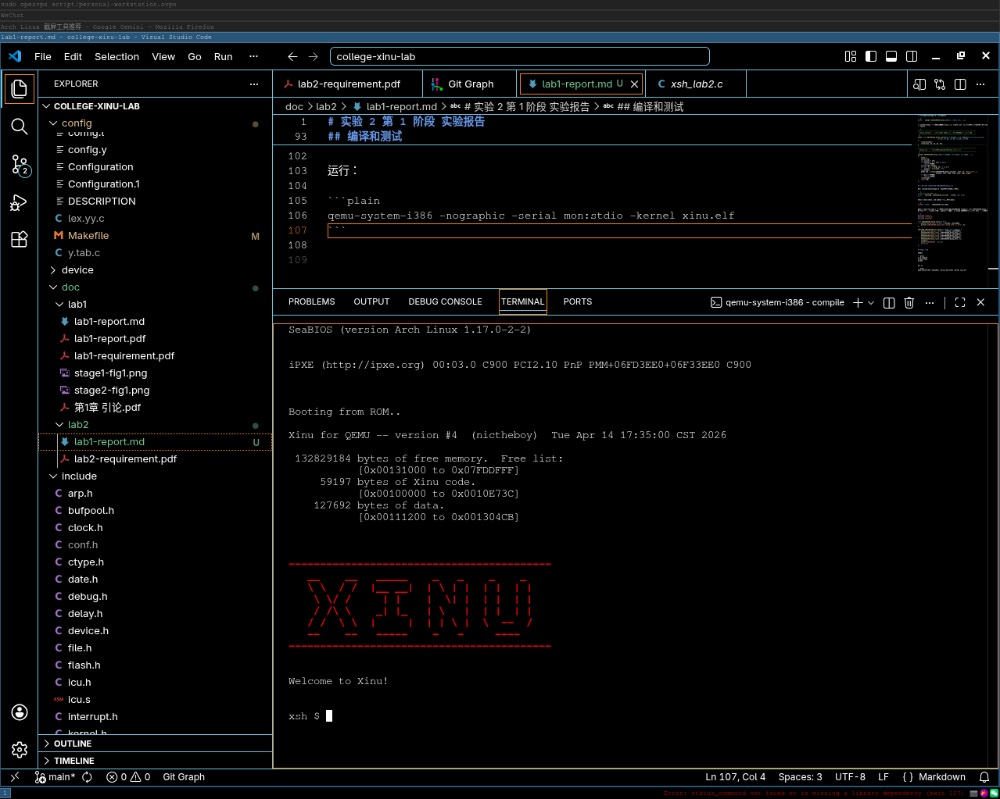
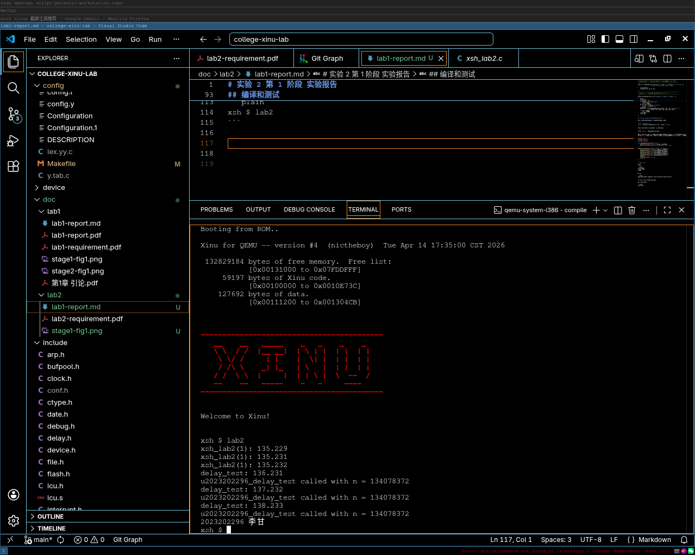

# 实验 2 第 1 阶段 实验报告

李甘 2023202296

说明：由于不知道应该修改什么文件，我使用了 Gemini 为我提供帮助。对话记录可以在 https://gemini.google.com/share/e8cce2888487 看到。

## 实现 k2023202296_delay_run 系统调用

在 include/prototypes.h 中创建声明：

```c
extern	syscall k2023202296_delay_run(int, void*, int, ...);
```

在 system/sleep.c 中实现该系统调用，思路为用 create 创建一个进程，这个进程的内容为先 sleep 然后执行 func：

```c
/*------------------------------------------------------------------------
 * delay_executor  -  (内部函数) 代理进程执行体，先休眠后执行目标函数
 *------------------------------------------------------------------------
 */
local void u2023202296_delay_executor(int seconds, void (*func)(int,int,int,int,int), 
                         int a1, int a2, int a3, int a4, int a5) 
{
    (*func)(a1, a2, a3, a4, a5);
}

/*------------------------------------------------------------------------
 * delay_run  -  异步延时调用指定的函数，不阻塞当前进程
 *------------------------------------------------------------------------
 */
syscall k2023202296_delay_run(int seconds, void *func, int nargs, ...) 
{
    int32 i;
    va_list ap;
    int args[5] = {0};
    if (seconds < 0 || func == NULL)
        return SYSERR;
    va_start(ap, nargs);
    for (i = 0; i < nargs && i < 5; i++)
        args[i] = va_arg(ap, int);
    va_end(ap);
    pid32 pid = create(u2023202296_delay_executor, 1024, 20, "delay_proc", 7, 
                       seconds, func, args, args, args, args, args);
    if (pid == SYSERR)
        return SYSERR;
    resume(pid);
    return OK;
}
```

## 实现 lab2 命令以测试 k2023202296_delay_run

先在 include/shprototypes.h 中声明这个命令的主函数：

```c
/* in file xsh_lab2.c */
extern	shellcmd  u2023202296_xsh_lab2	(int32, char *[]);
```

然后在 shell/shell.c 的 cmdtab 中注册这个命令：

```c
{"lab2",	FALSE,	u2023202296_xsh_lab2},
```

最后在 shell/xsh_lab2.c 中实现这个命令，最初没有最后的 sleep(4); ，在 k2023202296_delay_run 中的 func 被执行前命令进程就退出了，通过在最后加上 sleep 语句可以让主进程在 func 执行完成后再退出：

```c
#include <xinu.h>
#include <string.h>
#include <stdio.h>

void u2023202296_delay_test(int n) {
    printf("delay_test: %d.%d\n", clktime, count1000);
    printf("u2023202296_delay_test called with n = %d\n", n);
}

shellcmd u2023202296_xsh_lab2(int nargs, char *args[]) {
    printf("xsh_lab2(1): %d.%d\n", clktime, count1000);  
    k2023202296_delay_run(1, u2023202296_delay_test, 1); 
    printf("xsh_lab2(1): %d.%d\n", clktime, count1000);  
    k2023202296_delay_run(2, u2023202296_delay_test, 2); 
    printf("xsh_lab2(1): %d.%d\n", clktime, count1000);  
    k2023202296_delay_run(3, u2023202296_delay_test, 3);
    sleep(4);
    printf("2023202296 李甘\n");  
    return 0;
}
```

## 编译和测试

编译：

```plain
$ cd compile
$ make clean
$ make
```

运行：

```plain
qemu-system-i386 -nographic -serial mon:stdio -kernel xinu.elf
```



运行 lab2 命令：

```plain
xsh $ lab2
```



可以看到，命令的执行结果符合预期。

