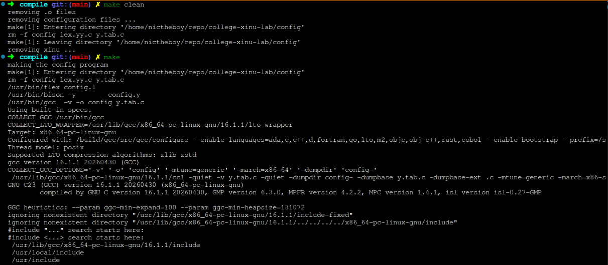
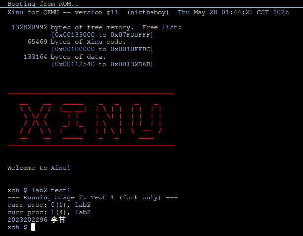
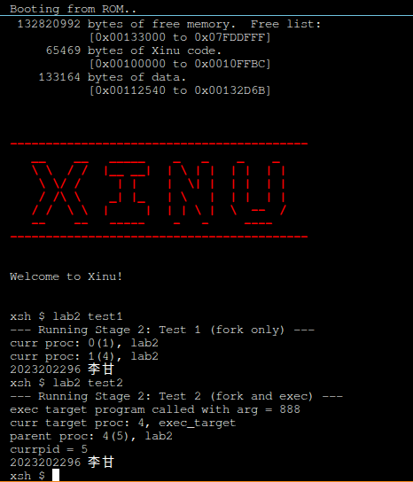

# 实验 2 第 2 阶段 实验报告

李甘 2023202296

## 实现 k2023202296_fork 与 k2023202296_exec 系统调用

在 `include/prototypes.h` 中创建声明：

```c
/* in file fork.c */
extern	syscall	k2023202296_fork(void);
extern	syscall	k2023202296_exec(void *, pri16, char *, uint32, ...);
```

新建 `system/fork.c` 实现这两个系统调用，完整代码如下：

```c
#include <xinu.h>
#include <stdarg.h>
#include <string.h>

struct ctxsw_frame {
    uint32 edi;
    uint32 esi;
    uint32 ebp;
    uint32 esp;
    uint32 ebx;
    uint32 edx;
    uint32 ecx;
    uint32 eax;
    uint32 eflags;
    uint32 saved_ebp;
    uint32 ret_addr;
};

/* Obtain a new process ID */
static pid32 k2023202296_newpid(void) {
    uint32 i;
    static pid32 nextpid = 1;

    for (i = 0; i < NPROC; i++) {
        nextpid %= NPROC;
        if (proctab[nextpid].prstate == PR_FREE) {
            return nextpid++;
        } else {
            nextpid++;
        }
    }
    return (pid32) SYSERR;
}

/*------------------------------------------------------------------------
 *  k2023202296_fork  -  Fork the current process to create a child
 *------------------------------------------------------------------------
 */
syscall k2023202296_fork(void) {
    uint32 parent_esp;
    uint32 parent_ebp;
    uint32 reg_ebx, reg_esi, reg_edi;
    intmask mask;
    pid32 parent_pid;
    struct procent *parent_prptr;
    pid32 child_pid;
    uint32 parent_stack_len;
    char *child_saddr;
    uint32 parent_stack_base;
    uint32 child_stack_base;
    uint32 delta;
    uint32 copy_size;
    uint32 child_copy_start;
    uint32 child_ebp;
    uint32 child_EBP_caller;
    uint32 parent_stack_limit;
    uint32 curr_ebp;
    struct ctxsw_frame *cf;
    struct procent *child_prptr;

    // Get current EBP, ESP, and callee-saved registers (ebx, esi, edi) at function start
    asm volatile("movl %%esp, %0" : "=r"(parent_esp));
    asm volatile("movl %%ebp, %0" : "=r"(parent_ebp));
    asm volatile("movl %%ebx, %0" : "=r"(reg_ebx));
    asm volatile("movl %%esi, %0" : "=r"(reg_esi));
    asm volatile("movl %%edi, %0" : "=r"(reg_edi));

    mask = disable();

    parent_pid = currpid;
    parent_prptr = &proctab[parent_pid];

    child_pid = k2023202296_newpid();
    if (child_pid == SYSERR) {
        restore(mask);
        return SYSERR;
    }

    parent_stack_len = parent_prptr->prstklen;
    child_saddr = getstk(parent_stack_len);
    if (child_saddr == (char *)SYSERR) {
        restore(mask);
        return SYSERR;
    }

    parent_stack_base = (uint32)parent_prptr->prstkbase;
    child_stack_base = (uint32)child_saddr;
    delta = child_stack_base - parent_stack_base;

    // Copy parent's stack from parent_ebp + 4 upwards to the base
    copy_size = parent_stack_base - (parent_ebp + 4);
    child_copy_start = child_stack_base - copy_size;
    memcpy((void *)child_copy_start, (void *)(parent_ebp + 4), copy_size);

    // Calculate child's EBP and caller's EBP
    child_ebp = parent_ebp + delta;
    child_EBP_caller = *(uint32 *)parent_ebp + delta;

    // Walk and adjust the frame pointer (%ebp) chain on the child stack
    parent_stack_limit = parent_stack_base - parent_stack_len + 4;
    curr_ebp = child_EBP_caller;
    while (curr_ebp >= (parent_stack_limit + delta) && curr_ebp < child_stack_base) {
        uint32 *next_ebp_ptr = (uint32 *)curr_ebp;
        uint32 next_ebp = *next_ebp_ptr;
        if (next_ebp >= parent_stack_limit && next_ebp < parent_stack_base) {
            *next_ebp_ptr = next_ebp + delta;
            curr_ebp = next_ebp + delta;
        } else {
            break;
        }
    }

    // Set up ctxsw frame for the child process, preserving parent's registers
    cf = (struct ctxsw_frame *)(child_copy_start - sizeof(struct ctxsw_frame));
    cf->edi = reg_edi;
    cf->esi = reg_esi;
    cf->ebp = child_ebp;
    cf->esp = 0;
    cf->ebx = reg_ebx; // Preserve GOT pointer/register
    cf->edx = 0;
    cf->ecx = 0;
    cf->eax = 0; // Return value for child is 0
    cf->eflags = 0x00000200; // Interrupts enabled
    cf->saved_ebp = child_EBP_caller;
    cf->ret_addr = *(uint32 *)(parent_ebp + 4); // return address of fork()

    // Initialize child process table entry
    child_prptr = &proctab[child_pid];
    *child_prptr = *parent_prptr;

    child_prptr->prstate = PR_SUSP;
    child_prptr->prstkbase = (char *)child_stack_base;
    child_prptr->prstklen = parent_stack_len;
    child_prptr->prstkptr = (char *)cf;
    child_prptr->prparent = parent_pid;
    child_prptr->prsem = -1;
    child_prptr->prhasmsg = FALSE;

    prcount++;

    ready(child_pid);

    restore(mask);
    return child_pid;
}

/*------------------------------------------------------------------------
 *  k2023202296_exec  -  Overlay current process context and run new func
 *------------------------------------------------------------------------
 */
syscall k2023202296_exec(void *funcaddr, pri16 priority, char *name, uint32 nargs, ...) {
    intmask mask;
    struct procent *prptr;
    uint32 *saddr;
    va_list ap;
    uint32 args[8] = {0};
    uint32 i;

    mask = disable();

    prptr = &proctab[currpid];

    // Update PCB
    prptr->prprio = priority;
    prptr->prname[PNMLEN - 1] = NULLCH;
    for (i = 0; i < PNMLEN - 1 && (prptr->prname[i] = name[i]) != NULLCH; i++)
        ;

    // Reset the stack to base
    saddr = (uint32 *)prptr->prstkbase;
    *saddr = STACKMAGIC;

    // Parse the variable arguments
    va_start(ap, nargs);
    for (i = 0; i < nargs && i < 8; i++) {
        args[i] = va_arg(ap, uint32);
    }
    va_end(ap);

    // Push the arguments onto the stack
    for (i = nargs; i > 0; i--) {
        *--saddr = args[i - 1];
    }

    // Push return address placeholder (INITRET / userret)
    *--saddr = (uint32)INITRET;

    // Reset ESP, EBP, enable interrupts, and jump to the entry point
    asm volatile(
        "movl %0, %%esp\n\t"
        "movl %1, %%ebp\n\t"
        "pushl %2\n\t"
        "sti\n\t"
        "ret\n\t"
        :
        : "r"(saddr), "r"(prptr->prstkbase), "r"(funcaddr)
        : "memory"
    );

    return OK; // Never reached
}
```

---

## 实现 lab2 命令以测试 fork 与 exec

在 `shell/xsh_lab2.c` 中完整实现测试逻辑，包含 fork-only 测试、fork & exec 测试及第一阶段的 delay 测试：

```c
#include <xinu.h>
#include <string.h>
#include <stdio.h>

#define fork() k2023202296_fork()
#define exec k2023202296_exec

/* Stage 1: Delay Run Test Functions */
void u2023202296_delay_test(int n) {
    printf("delay_test: %d.%d\n", clktime, count1000);
    printf("u2023202296_delay_test called with n = %d\n", n);
}

/* Stage 2: Exec Target Function */
void u2023202296_exec_test_func(int arg) {
    printf("exec target program called with arg = %d\n", arg);
    printf("curr target proc: %d, %s\n", currpid, proctab[currpid].prname);
}

shellcmd u2023202296_xsh_lab2(int nargs, char *args[]) {
    // If no arguments or called with 'delay', run Stage 1 delay run tests
    if (nargs == 1 || (nargs == 2 && strncmp(args[1], "delay", 6) == 0)) {
        printf("--- Running Stage 1: delay_run tests ---\n");
        printf("xsh_lab2(1): %d.%d\n", clktime, count1000);  
        k2023202296_delay_run(1, u2023202296_delay_test, 1, 1); 
        printf("xsh_lab2(1): %d.%d\n", clktime, count1000);  
        k2023202296_delay_run(2, u2023202296_delay_test, 1, 2); 
        printf("xsh_lab2(1): %d.%d\n", clktime, count1000);  
        k2023202296_delay_run(3, u2023202296_delay_test, 1, 3);
        sleep(4);
        printf("2023202296 李甘\n");  
        return 0;
    }

    if (nargs == 2 && strncmp(args[1], "test1", 6) == 0) {
        printf("--- Running Stage 2: Test 1 (fork only) ---\n");
        int pid = fork();
        if (pid < 0) {
            printf("fork failed\n");
            return 1;
        }
        printf("curr proc: %d(%d), %s\n", pid, currpid, proctab[currpid].prname);
        
        if (pid == 0) {
            // Child exits to avoid continuing command execution
            return 0;
        }
        sleepms(200); // Wait for child output to finish printing cleanly
        printf("2023202296 李甘\n");
        return 0;
    }

    if (nargs == 2 && strncmp(args[1], "test2", 6) == 0) {
        printf("--- Running Stage 2: Test 2 (fork and exec) ---\n");
        int pid = fork();
        if (pid < 0) {
            printf("fork failed\n");
            return 1;
        }
        if (pid == 0) {
            exec(u2023202296_exec_test_func, 20, "exec_target", 1, 888);
            printf("exec failed!\n");
            return 1;
        } else if (pid > 0) {
            printf("parent proc: %d(%d), %s\n", pid, currpid, proctab[currpid].prname);
            sleepms(200); // Wait for child to run and finish printing
        }
        printf("currpid = %d\n", currpid);
        printf("2023202296 李甘\n");
        return 0;
    }

    printf("Usage: lab2 [delay|test1|test2]\n");
    return 1;
}
```

---

## 编译和测试

编译代码：

```plain
$ cd compile
$ make clean
$ make
```



运行 QEMU：

```plain
qemu-system-i386 -nographic -serial mon:stdio -kernel xinu.elf
```

### 1. 运行 `lab2 test1` 测试仅 fork 功能

在 Xinu 终端中执行以下命令：

```plain
xsh $ lab2 test1
```



### 2. 运行 `lab2 test2` 测试 fork + exec 功能

在 Xinu 终端中执行以下命令：

```plain
xsh $ lab2 test2
```


