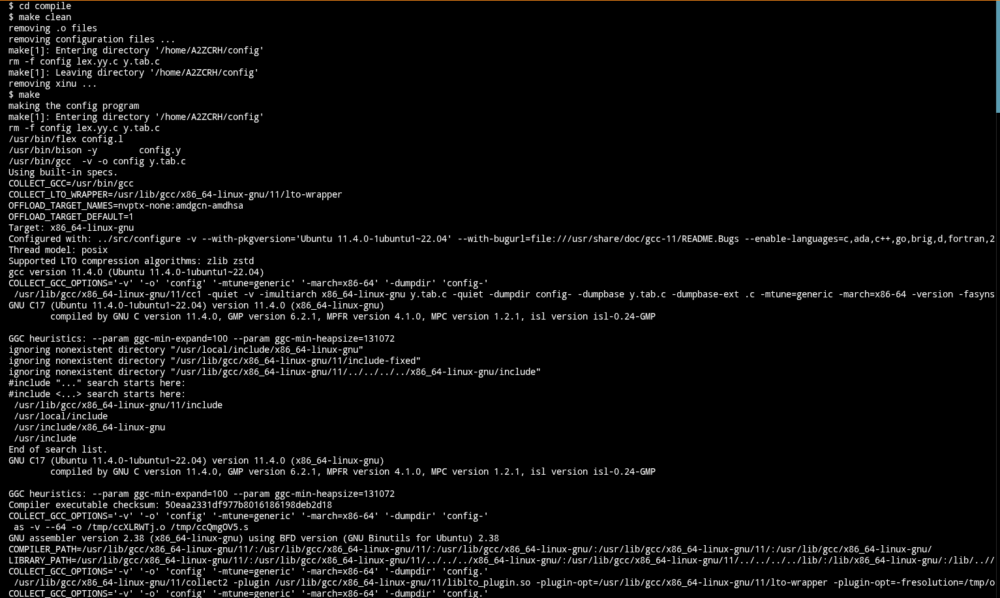
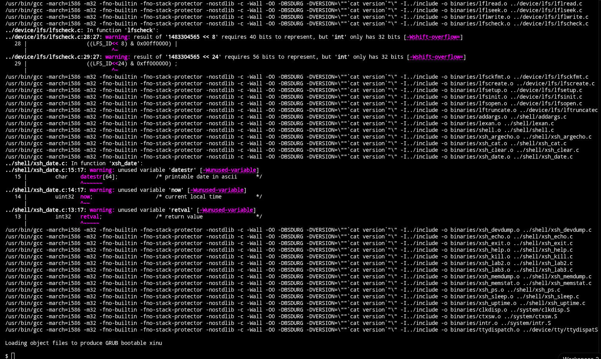
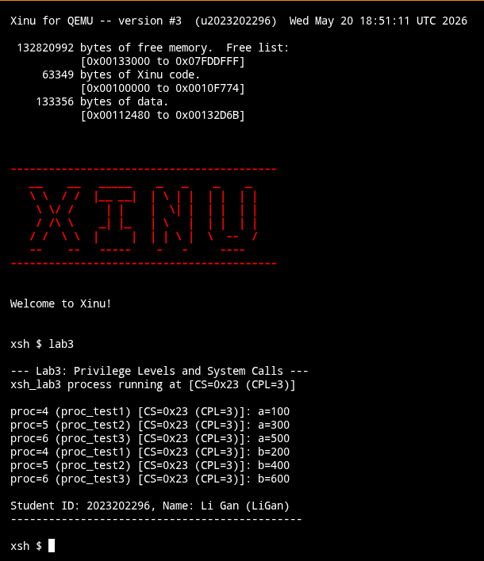

# 实验 3 实验报告

李甘 2023202296

本报告记录了在 x86 Xinu 系统中实现 Ring 0 向 Ring 3 特权级切换以及软件中断系统调用的设计与具体代码。

## 新增的文件和修改过的原有代码文件

本实验中新增的文件：
- include/Lab3.h
- system/Lab3.c
- shell/xsh_lab3.c

本实验中修改过的原有代码文件：
- config/Makefile
- config/config.l
- config/config.y
- include/process.h
- include/xinu.h
- shell/addargs.c
- shell/shell.c
- system/initialize.c
- system/kill.c
- system/resched.c

## 功能的实现

新增的头文件 include/Lab3.h，定义了 TSS 段结构体、系统调用号以及函数声明：

```c
#ifndef _LAB3_H_
#define _LAB3_H_

/* TSS Segment Struct */
struct __attribute__((packed)) k2023202296_tss_struct {
	uint32	link;
	uint32	esp0;
	uint32	ss0;
	uint32	esp1;
	uint32	ss1;
	uint32	esp2;
	uint32	ss2;
	uint32	cr3;
	uint32	eip;
	uint32	eflags;
	uint32	eax;
	uint32	ecx;
	uint32	edx;
	uint32	ebx;
	uint32	esp;
	uint32	ebp;
	uint32	esi;
	uint32	edi;
	uint32	es;
	uint32	cs;
	uint32	ss;
	uint32	ds;
	uint32	fs;
	uint32	gs;
	uint32	ldt;
	uint16	trap;
	uint16	iomap;
};

extern struct k2023202296_tss_struct k2023202296_tss;

/* Syscall numbers */
#define SYS_GETPID   0
#define SYS_PUTCHAR  1
#define SYS_CREATE   2
#define SYS_RESUME   3
#define SYS_SLEEP    4
#define SYS_EXIT     5

/* Kernel functions */
void k2023202296_lab3_init(void);
void k2023202296_set_syscall_vector(uint32 handler);
void k2023202296_syscall_handler(uint32 *regs);
void k2023202296_user_bootstrap(void);
pid32 k2023202296_create_user_proc_internal(void *funcaddr, uint32 ssize, char *name, uint32 *args);
void k2023202296_user_exit_internal(void);

/* User-mode functions */
uint32 u2023202296_syscall(uint32 num, uint32 arg1, uint32 arg2, uint32 arg3, uint32 arg4);
pid32 u2023202296_create_user_proc(void *funcaddr, uint32 ssize, pri16 priority, char *name, uint32 nargs, ...);
void u2023202296_user_exit(void);

/* Shell commands */
shellcmd u2023202296_xsh_lab3(int32 nargs, char *args[]);
void u2023202296_uptest(int32 a, int32 b);

/* Helper wrapper for creating user process */
pid32 k2023202296_create_user_proc(
	void		*funcaddr,	/* Address of the function	*/
	uint32		ssize,		/* Stack size in bytes		*/
	pri16		priority,	/* Process priority > 0		*/
	char		*name,		/* Name (for debugging)		*/
	uint32		nargs,		/* Number of args that follow	*/
	...
);

#endif /* _LAB3_H_ */
```

修改 include/process.h，在 procent 进程控制块结构体中增加了用户态堆栈及函数相关字段：

```c
	int16	prdesc[NDESC];	/* Device descriptors for process	*/
	/*Lab3 2023202296: Begin*/
	char	*prusrstkptr;	/* Saved user stack pointer		*/
	char	*prusrstkbase;	/* User stack base			*/
	uint32	prusrstklen;	/* User stack length in bytes		*/
	bool8	prisuser;	/* Whether this is a user-mode process	*/
	void	*prusrfuncaddr;	/* User process function address	*/
	/*Lab3 2023202296: End*/
};
```

修改 include/xinu.h，引入 Lab3.h 头文件：

```c
#include <stdio.h>
#include <string.h>
/*Lab3 2023202296: Begin*/
#include <Lab3.h>
/*Lab3 2023202296: End*/
```

新增 system/Lab3.c，负责初始化用户态 GDT 表项、TSS 状态段、注册 0x80 中断向量门、汇编中断入口、系统调用分发、内核 Ring 3 引导逻辑以及用户态一般化进程栈的创建分配：

```c
#include <xinu.h>
#include <stdarg.h>
#include <string.h>

/* Segment Descriptor */
struct __attribute__ ((__packed__)) sd {
	unsigned short	sd_lolimit;
	unsigned short	sd_lobase;
	unsigned char	sd_midbase;
	unsigned char   sd_access;
	unsigned char	sd_hilim_fl;
	unsigned char	sd_hibase;
};

#define LAB3_GDT_ENTRIES 7

/* Expanded GDT array for user segments and TSS */
struct sd k2023202296_gdt[LAB3_GDT_ENTRIES];
struct {
	unsigned short limit;
	unsigned int base;
} __attribute__((packed)) k2023202296_gdtr;

/* Global TSS */
struct k2023202296_tss_struct k2023202296_tss;

/* Initialize GDT, TSS, and system call interrupt vector */
void k2023202296_lab3_init(void) {
	extern struct sd gdt[];
	
	/* 1. Copy original 4 kernel entries */
	memcpy(k2023202296_gdt, gdt, 4 * sizeof(struct sd));
	
	/* 2. User Code Segment (Index 4) */
	k2023202296_gdt[4].sd_lolimit = 0xffff;
	k2023202296_gdt[4].sd_lobase = 0;
	k2023202296_gdt[4].sd_midbase = 0;
	k2023202296_gdt[4].sd_access = 0xfa;     /* DPL = 3, Executable, Readable */
	k2023202296_gdt[4].sd_hilim_fl = 0xcf;    /* Granularity = 1, Size = 1 */
	k2023202296_gdt[4].sd_hibase = 0;
	
	/* 3. User Data Segment (Index 5) */
	k2023202296_gdt[5].sd_lolimit = 0xffff;
	k2023202296_gdt[5].sd_lobase = 0;
	k2023202296_gdt[5].sd_midbase = 0;
	k2023202296_gdt[5].sd_access = 0xf2;     /* DPL = 3, Writeable, Readable */
	k2023202296_gdt[5].sd_hilim_fl = 0xcf;    /* Granularity = 1, Size = 1 */
	k2023202296_gdt[5].sd_hibase = 0;
	
	/* 4. Task State Segment (Index 6) */
	memset(&k2023202296_tss, 0, sizeof(k2023202296_tss));
	k2023202296_tss.ss0 = 0x18;               /* Kernel SS */
	k2023202296_tss.iomap = sizeof(k2023202296_tss); /* Disable IO Map */
	
	uint32 tss_base = (uint32)&k2023202296_tss;
	uint32 tss_limit = sizeof(k2023202296_tss) - 1;
	
	k2023202296_gdt[6].sd_lolimit = tss_limit & 0xffff;
	k2023202296_gdt[6].sd_lobase = tss_base & 0xffff;
	k2023202296_gdt[6].sd_midbase = (tss_base >> 16) & 0xff;
	k2023202296_gdt[6].sd_access = 0x89;     /* Present, DPL = 0, 32-bit Available TSS */
	k2023202296_gdt[6].sd_hilim_fl = ((tss_limit >> 16) & 0xf);
	k2023202296_gdt[6].sd_hibase = (tss_base >> 24) & 0xff;
	
	/* 5. Load new GDTR */
	k2023202296_gdtr.limit = (LAB3_GDT_ENTRIES * sizeof(struct sd)) - 1;
	k2023202296_gdtr.base = (uint32)k2023202296_gdt;
	asm volatile("lgdt %0" : : "m"(k2023202296_gdtr));
	
	/* 6. Load TSS (Selector 0x30 = Index 6) */
	asm volatile("ltr %%ax" : : "a"(0x30));
	
	/* 7. Set IDT interrupt vector 0x80 */
	extern void k2023202296_syscall_entry(void);
	k2023202296_set_syscall_vector((uint32)k2023202296_syscall_entry);
}

/* IDT Gate Descriptor */
struct __attribute__ ((__packed__)) k2023202296_idt_entry {
	unsigned short	igd_loffset;
	unsigned short	igd_segsel;
	unsigned int	igd_rsvd : 5;
	unsigned int	igd_mbz : 3;
	unsigned int	igd_type : 5;
	unsigned int	igd_dpl : 2;
	unsigned int	igd_present : 1;
	unsigned short	igd_hoffset;
};

/* Helper to register system call in IDT */
void k2023202296_set_syscall_vector(uint32 handler) {
	extern struct k2023202296_idt_entry idt[];
	struct k2023202296_idt_entry *pidt = &idt[128]; /* Vector 128 (0x80) */
	pidt->igd_loffset = handler;
	pidt->igd_segsel = 0x8;       /* Kernel Code */
	pidt->igd_rsvd = 0;
	pidt->igd_mbz = 0;
	pidt->igd_type = 0xe;         /* 32-bit Interrupt Gate */
	pidt->igd_dpl = 3;            /* User DPL */
	pidt->igd_present = 1;
	pidt->igd_hoffset = handler >> 16;
}

/* Assembly entry point for system calls */
__asm__(
".globl k2023202296_syscall_entry\n"
"k2023202296_syscall_entry:\n"
"    pushl %es\n"
"    pushl %ds\n"
"    pushal\n"
"    movl $0x10, %eax\n"
"    movw %ax, %ds\n"
"    movw %ax, %es\n"
"    pushl %esp\n"
"    call k2023202296_syscall_handler\n"
"    addl $4, %esp\n"
"    popal\n"
"    popl %ds\n"
"    popl %es\n"
"    iret\n"
);

/* C Dispatcher for system calls */
void k2023202296_syscall_handler(uint32 *regs) {
	uint32 num  = regs[7];  /* EAX */
	uint32 arg1 = regs[4];  /* EBX */
	uint32 arg2 = regs[6];  /* ECX */
	uint32 arg3 = regs[5];  /* EDX */
	uint32 arg4 = regs[1];  /* ESI */
	
	switch (num) {
		case SYS_GETPID:
			regs[7] = (uint32)currpid;
			break;
		case SYS_PUTCHAR:
			putc(CONSOLE, (char)arg1);
			regs[7] = OK;
			break;
		case SYS_CREATE:
			regs[7] = (uint32)k2023202296_create_user_proc_internal(
				(void*)arg1,
				arg2,
				(char*)arg3,
				(uint32*)arg4
			);
			break;
		case SYS_RESUME:
			regs[7] = (uint32)resume((pid32)arg1);
			break;
		case SYS_SLEEP:
			regs[7] = (uint32)sleepms(arg1);
			break;
		case SYS_EXIT:
			k2023202296_user_exit_internal();
			break;
		default:
			regs[7] = SYSERR;
			break;
	}
}

/* Bootstrap wrapper in Kernel mode to enter Ring 3 */
void k2023202296_user_bootstrap(void) {
	struct procent *prptr = &proctab[currpid];
	
	/* Set TSS esp0 to the top of the process's kernel stack */
	k2023202296_tss.esp0 = (uint32)prptr->prstkbase;
	
	/* Retrieve arguments for shell command from kernel stack if needed */
	/* When xsh_lab3 starts, ntok and args vector pointer are copied to user stack */
	if (strncmp(prptr->prname, "lab3", 4) == 0) {
		uint32 ntok = ((uint32 *)prptr->prstkbase)[-2];
		uint32 args = ((uint32 *)prptr->prstkbase)[-1];
		
		uint32 *usr_base = (uint32 *)prptr->prusrstkbase;
		usr_base[-1] = args;
		usr_base[-2] = ntok;
		usr_base[-3] = (uint32)u2023202296_user_exit;
		
		prptr->prusrstkptr = (char *)&usr_base[-3];
	}
	
	uint32 user_esp = (uint32)prptr->prusrstkptr;
	uint32 eflags   = 0x200; /* Interrupts enabled */
	uint32 user_eip = (uint32)prptr->prusrfuncaddr;
	
	asm volatile(
		"movw $0x2b, %%ax\n\t"
		"movw %%ax, %%ds\n\t"
		"movw %%ax, %%es\n\t"
		"movw %%ax, %%fs\n\t"
		"movw %%ax, %%gs\n\t"
		"pushl $0x2b\n\t"     /* SS */
		"pushl %0\n\t"     /* ESP */
		"pushl %1\n\t"     /* EFLAGS */
		"pushl $0x23\n\t"     /* CS */
		"pushl %2\n\t"     /* EIP */
		"iret"
		:
		: "r"(user_esp), "r"(eflags), "r"(user_eip)
		: "ax", "memory"
	);
}

/* Obtain a new process ID */
static pid32 k2023202296_newpid(void) {
	uint32	i;
	static	pid32 nextpid = 1;

	for (i = 0; i < NPROC; i++) {
		nextpid %= NPROC;
		if (proctab[nextpid].prstate == PR_FREE) {
			return nextpid++;
		} else {
			nextpid++;
		}
	}
	return (pid32) SYSERR;
}

/* Internal implementation of user process creation */
pid32 k2023202296_create_user_proc_internal(
	void *funcaddr,
	uint32 ssize,
	char *name,
	uint32 *args
) {
	intmask mask;
	pid32 pid;
	struct procent *prptr;
	uint32 *kstack;
	uint32 *ustack;
	uint32 *ksaddr;
	uint32 *usaddr;
	int32 i;
	
	mask = disable();
	
	pid = k2023202296_newpid();
	if (pid == SYSERR) {
		restore(mask);
		return SYSERR;
	}
	
	/* Kernel stack: 4KB, User stack: 8KB */
	kstack = (uint32 *)getstk(4096);
	ustack = (uint32 *)getstk(8192);
	
	if (kstack == (uint32 *)SYSERR || ustack == (uint32 *)SYSERR) {
		restore(mask);
		return SYSERR;
	}
	
	prcount++;
	prptr = &proctab[pid];
	
	/* Initialize PCB */
	prptr->prstate = PR_SUSP;
	prptr->prprio = INITPRIO; /* User priority is 20 */
	prptr->prstkbase = (char *)kstack;
	prptr->prstklen = 4096;
	prptr->prusrstkbase = (char *)ustack;
	prptr->prusrstklen = 8192;
	prptr->prisuser = TRUE;
	prptr->prusrfuncaddr = funcaddr;
	
	prptr->prname[PNMLEN-1] = NULLCH;
	for (i = 0; i < PNMLEN - 1 && (prptr->prname[i] = name[i]) != NULLCH; i++)
		;
	prptr->prsem = -1;
	prptr->prparent = (pid32)getpid();
	prptr->prhasmsg = FALSE;
	
	prptr->prdesc[0] = CONSOLE;
	prptr->prdesc[1] = CONSOLE;
	prptr->prdesc[2] = CONSOLE;
	
	/* 1. Setup User Stack (Args & return address) */
	*ustack = STACKMAGIC;
	usaddr = ustack;
	*--usaddr = args[1];
	*--usaddr = args[0];
	*--usaddr = (uint32)u2023202296_user_exit;
	
	prptr->prusrstkptr = (char *)usaddr;
	
	/* 2. Setup Kernel Stack (Context switched frame returning to bootstrap) */
	*kstack = STACKMAGIC;
	ksaddr = kstack;
	
	/* Push arguments onto kernel stack for addargs to find and replace */
	*--ksaddr = args[1]; /* args[1] (which is dummy) */
	*--ksaddr = args[0]; /* args[0] (which is nargs) */
	*--ksaddr = (uint32)u2023202296_user_exit; /* Return address placeholder */
	
	*--ksaddr = (uint32)k2023202296_user_bootstrap; /* ctxsw returns to bootstrap */
	*--ksaddr = (uint32)kstack; /* EBP */
	
	uint32 savsp = (uint32)ksaddr;
	*--ksaddr = 0x00000200; /* EFLAGS with interrupts enabled */
	
	/* pushal mock registers */
	*--ksaddr = 0; /* EAX */
	*--ksaddr = 0; /* ECX */
	*--ksaddr = 0; /* EDX */
	*--ksaddr = 0; /* EBX */
	*--ksaddr = 0; /* ESP */
	uint32 *pushsp = ksaddr;
	*--ksaddr = savsp; /* EBP */
	*--ksaddr = 0; /* ESI */
	*--ksaddr = 0; /* EDI */
	
	*pushsp = (unsigned long)ksaddr;
	prptr->prstkptr = (char *)ksaddr;
	
	restore(mask);
	return pid;
}

/* Helper to create user process in Kernel Mode */
pid32 k2023202296_create_user_proc(
	void *funcaddr,
	uint32 ssize,
	pri16 priority,
	char *name,
	uint32 nargs,
	...
) {
	uint32 args[4] = {0};
	va_list ap;
	va_start(ap, nargs);
	for (uint32 i = 0; i < nargs && i < 4; i++) {
		args[i] = va_arg(ap, uint32);
	}
	va_end(ap);
	return k2023202296_create_user_proc_internal(funcaddr, ssize, name, args);
}

/* User-mode system call implementation */
uint32 u2023202296_syscall(uint32 num, uint32 arg1, uint32 arg2, uint32 arg3, uint32 arg4) {
	uint32 ret;
	asm volatile(
		"int $0x80"
		: "=a"(ret)
		: "a"(num), "b"(arg1), "c"(arg2), "d"(arg3), "S"(arg4)
		: "memory"
	);
	return ret;
}

/* User-mode implementation of process creation */
pid32 u2023202296_create_user_proc(
	void *funcaddr,
	uint32 ssize,
	pri16 priority,
	char *name,
	uint32 nargs,
	...
) {
	uint32 args[4] = {0};
	va_list ap;
	va_start(ap, nargs);
	for (uint32 i = 0; i < nargs && i < 4; i++) {
		args[i] = va_arg(ap, uint32);
	}
	va_end(ap);
	return (pid32)u2023202296_syscall(SYS_CREATE, (uint32)funcaddr, ssize, (uint32)name, (uint32)args);
}

/* User-mode exit function */
void u2023202296_user_exit(void) {
	u2023202296_syscall(SYS_EXIT, 0, 0, 0, 0);
}

/* Kernel implementation of process exit */
void k2023202296_user_exit_internal(void) {
	kill(currpid);
}
```

修改 system/initialize.c，在系统初始化 sysinit 末尾增加对 Lab3 初始化程序的调用：

```c
	for (i = 0; i < NDEVS; i++) {
		init(i);
	}
	/*Lab3 2023202296: Begin*/
	k2023202296_lab3_init();
	/*Lab3 2023202296: End*/
	return;
}
```

修改 system/resched.c，在进程上下文切换前更新任务状态段 TSS.esp0 指向目标用户进程的内核栈基址：

```c
	ptnew = &proctab[currpid];
	ptnew->prstate = PR_CURR;
	preempt = QUANTUM;		/* Reset time slice for process	*/
	/*Lab3 2023202296: Begin*/
	if (ptnew->prisuser) {
		k2023202296_tss.esp0 = (uint32)ptnew->prstkbase;
	}
	/*Lab3 2023202296: End*/
	ctxsw(&ptold->prstkptr, &ptnew->prstkptr);
```

修改 system/kill.c，在进程被杀死时释放分配给用户态进程的 8KB 用户栈堆栈空间：

```c
	freestk(prptr->prstkbase, prptr->prstklen);
	/*Lab3 2023202296: Begin*/
	if (prptr->prisuser) {
		freestk(prptr->prusrstkbase, prptr->prusrstklen);
	}
	/*Lab3 2023202296: End*/
```

## 测试的编写

修改 shell/shell.c，注册 lab3 命令，并在此命令启动时调用 k2023202296_create_user_proc 创建用户进程，保证整个 lab3 命令运行在特权级 3（用户态）下：

```c
const	struct	cmdent	cmdtab[] = {
	{"sleep",	FALSE,	xsh_sleep},
	{"uptime",	FALSE,	xsh_uptime},
	{"lab2",	FALSE,	u2023202296_xsh_lab2},
	/*Lab3 2023202296: Begin*/
	{"lab3",	FALSE,	u2023202296_xsh_lab3},
	/*Lab3 2023202296: End*/
	{"?",		FALSE,	xsh_help}
```

```c
		/* Spawn child thread for non-built-in commands */

		/*Lab3 2023202296: Begin*/
		if (strncmp(cmdtab[j].cname, "lab3", 4) == 0) {
			child = k2023202296_create_user_proc(cmdtab[j].cfunc,
				SHELL_CMDSTK, SHELL_CMDPRIO,
				cmdtab[j].cname, 2, ntok, &tmparg);
		} else {
			child = create(cmdtab[j].cfunc,
				SHELL_CMDSTK, SHELL_CMDPRIO,
				cmdtab[j].cname, 2, ntok, &tmparg);
		}
		/*Lab3 2023202296: End*/
```

修改 shell/addargs.c，如果是用户态进程则将传参重定向复制到用户栈：

```c
	/*	args array will be stored followed by the argument	*/
	/*	strings							*/
	
	/*Lab3 2023202296: Begin*/
	char *stkbase;
	uint32 stklen;
	if (prptr->prisuser) {
		stkbase = prptr->prusrstkbase;
		stklen = prptr->prusrstklen;
	} else {
		stkbase = prptr->prstkbase;
		stklen = prptr->prstklen;
	}
	aloc = (uint32) (stkbase - stklen + sizeof(uint32));
	/*Lab3 2023202296: End*/
```

新增 shell/xsh_lab3.c，实现了用户态 xsh_lab3 命令入口、基于系统调用 u2023202296_syscall(SYS_PUTCHAR) 的用户态自定义 printf 实现，以及用于检查 CPL 特权级的特权进程函数 uptest：

```c
#include <xinu.h>
#include <stdarg.h>

/* Internal printf formatting helper */
extern void _fdoprnt(char *, va_list, int (*func) (int, int), int);

/* Private helper for user-mode printf */
static int u2023202296_sprntf(int acpp, int ac) {
	char **cpp = (char **)acpp;
	char c = (char)ac;
	return (*(*cpp)++ = c);
}

/* User-mode printf using system call */
void u2023202296_printf(char *fmt, ...) {
	char buf[256];
	va_list ap;
	char *s = buf;
	
	va_start(ap, fmt);
	_fdoprnt(fmt, ap, u2023202296_sprntf, (int)&s);
	va_end(ap);
	*s = '\0';
	
	char *p = buf;
	while (*p) {
		u2023202296_syscall(SYS_PUTCHAR, (uint32)*p, 0, 0, 0);
		p++;
	}
}

/* User-mode system call wrappers */
pid32 u2023202296_getpid(void) {
	return (pid32)u2023202296_syscall(SYS_GETPID, 0, 0, 0, 0);
}

status u2023202296_sleepms(uint32 ms) {
	return (status)u2023202296_syscall(SYS_SLEEP, ms, 0, 0, 0);
}

status u2023202296_resume(pid32 pid) {
	return (status)u2023202296_syscall(SYS_RESUME, (uint32)pid, 0, 0, 0);
}

/* User-mode process function */
void u2023202296_uptest(int32 a, int32 b) {
	pid32 pid = u2023202296_getpid();
	uint32 cs;
	
	/* Read CS register to verify privilege level (CPL = CS & 3) */
	asm volatile("movl %%cs, %0" : "=r"(cs));
	
	/* Step 1: Output process ID, name, 1st parameter and privilege mode */
	u2023202296_printf("proc=%d (%s) [CS=0x%X (CPL=%d)]: a=%d\n", 
		pid, proctab[pid].prname, cs, cs & 3, a);
	
	/* Step 2: Sleep for at least 1 time slice (e.g. 150 ms) */
	u2023202296_sleepms(150);
	
	/* Step 3: Output process ID, name, 2nd parameter and privilege mode */
	u2023202296_printf("proc=%d (%s) [CS=0x%X (CPL=%d)]: b=%d\n", 
		pid, proctab[pid].prname, cs, cs & 3, b);
}

/* User-mode shell command */
shellcmd u2023202296_xsh_lab3(int32 nargs, char *args[]) {
	pid32 p1, p2, p3;
	uint32 cs;
	
	asm volatile("movl %%cs, %0" : "=r"(cs));
	
	u2023202296_printf("\n--- Lab3: Privilege Levels and System Calls ---\n");
	u2023202296_printf("xsh_lab3 process running at [CS=0x%X (CPL=%d)]\n\n", cs, cs & 3);
	
	/* Create three user-mode child processes with different parameters */
	p1 = u2023202296_create_user_proc((void *)u2023202296_uptest, 8192, 20, "proc_test1", 2, 100, 200);
	p2 = u2023202296_create_user_proc((void *)u2023202296_uptest, 8192, 20, "proc_test2", 2, 300, 400);
	p3 = u2023202296_create_user_proc((void *)u2023202296_uptest, 8192, 20, "proc_test3", 2, 500, 600);
	
	if (p1 == SYSERR || p2 == SYSERR || p3 == SYSERR) {
		u2023202296_printf("Error: Failed to create user-mode processes\n");
		return SYSERR;
	}
	
	/* Resume the three child processes */
	u2023202296_resume(p1);
	u2023202296_resume(p2);
	u2023202296_resume(p3);
	
	/* Sleep to let children complete */
	u2023202296_sleepms(600);
	
	/* Output student ID and name */
	u2023202296_printf("\nStudent ID: 2023202296, Name: Li Gan (LiGan)\n");
	u2023202296_printf("----------------------------------------------\n\n");
	
	return OK;
}
```

## 验证

编译代码：





然后运行系统：

```plain
qemu-system-i386 -nographic -serial mon:stdio -kernel xinu.elf
```


