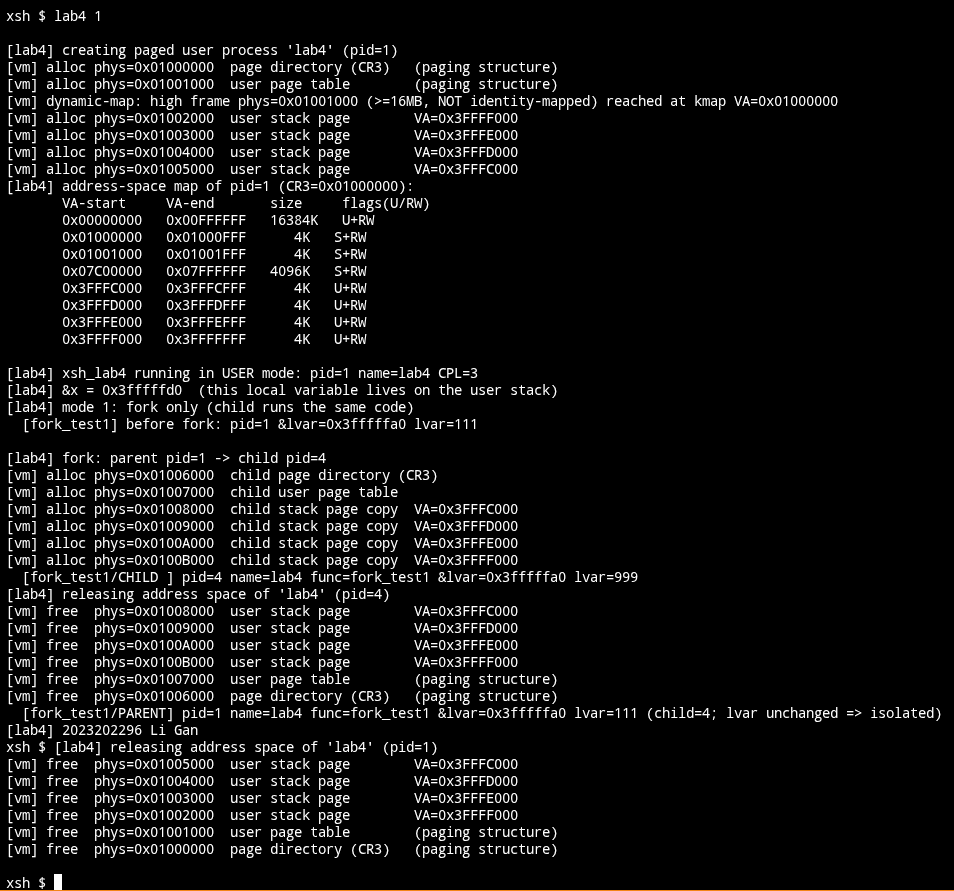
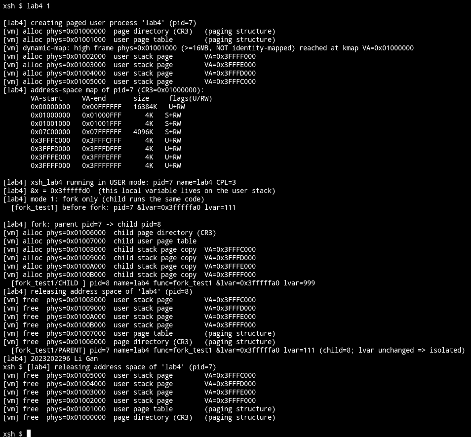
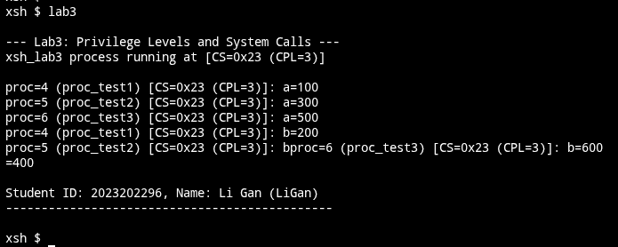

# 实验 4 页式内存管理 实验报告

2023202296 李甘

本报告记录在 x86 Xinu 上实现页式（虚拟）内存管理的设计与代码。实验在实验 3（Ring0/Ring3 特权级切换与 int $0x80 系统调用）的基础上完成：开启分页、区分内核态/用户态并隔离进程地址空间、实现支持分页的用户态 fork/exec，并提供页式内存下的用户态堆分配/释放和按需缺页扩展的用户栈，最后用用户态命令 lab4 测试。

## 新增的文件和修改过的原有代码文件

本实验中新增的文件：
- include/Lab4.h
- system/Lab4.c
- system/Lab4_fork.c
- system/Lab4_mem.c
- shell/xsh_lab4.c

本实验中修改过的原有代码文件：
- include/process.h
- include/xinu.h
- system/initialize.c
- system/create.c
- system/resched.c
- system/kill.c
- system/Lab3.c
- shell/shell.c

## 设计思路与内存布局

采用 x86 两级分页、4KB 页。低 16MB 物理内存在每个页目录里都恒等映射成“内核区”（标志 U+RW），内核代码、数据、内核堆都在这里；因为用户态测试函数是链接进内核镜像的，把内核区标记为用户可访问，用户进程才能在 CPL=3 取指执行。16MB 以上的物理内存不做恒等映射，作为空闲帧池由 palloc 按需分配，内核要访问某个高端帧时通过一个动态映射窗口（kmap）临时映射后再访问（即“高端内存”的做法），用户进程的页目录、页表、用户栈帧、用户堆帧全部取自高端帧池，因此每次运行 lab4 都必然触发动态映射。每个用户进程拥有自己的页目录，用户栈和用户堆都落在该进程私有的 PDE 255（0x3FC00000–0x40000000，4MB）里，由各进程私有的帧支撑，从而实现进程隔离。用户栈在高地址端、向下增长，栈顶 0x40000000，初始只预分配 16KB，触及更低的页时由缺页处理程序按需补帧，至多 2MB（小于 4MB 上限）；用户堆在低地址端、向上增长，按页分配，至多 2MB；两者相向而行、互不重叠。

一个 lab4 进程的虚拟地址空间布局如下（段为平基址，线性地址等于偏移）：

```
  0x00000000 ─ 0x00FFFFFF   内核区：代码/数据/内核堆（所有进程共享，恒等映射）   U+RW
  0x01000000 ─ 0x0103FFFF   动态映射窗口 kmap（64 槽，仅内核态使用）             S+RW
  0x07C00000 ─ 0x07FFFFFF   引导/null 进程栈所在 4MB（恒等映射）                S+RW
  ── 下面整段是 PDE 255（0x3FC00000–0x40000000，4MB，进程私有）──
  0x3FC00000 ─ 0x3FDFFFFF   用户堆：向上增长，按页分配，至多 2MB                U+RW
  0x3FE00000 ─ 0x3FFFFFFF   用户栈：向下增长，按需缺页扩展，至多 2MB            U+RW
                            （栈顶 0x40000000；初始仅预分配最高 16KB）
```

页目录帧、用户页表帧本身是分页结构，不出现在进程线性地址空间里（内核只用 kmap 临时访问）；真正映射进线性空间的是用户栈帧（初始在 0x3FFFC000–0x3FFFFFFF，扩展后向下延伸）和按需分配的用户堆帧（从 0x3FC00000 向上）。

## 头文件 include/Lab4.h

定义了分页相关常量、堆/栈区间、系统调用号、exec 参数结构体与全部新函数声明：

```c
/* 页表项标志位 */
#define K4_PRESENT   0x001
#define K4_RW        0x002
#define K4_USER      0x004

/* 地址空间布局 */
#define K4_LOWMEM_END   0x01000000u   /* 16MB：恒等映射的内核区上界  */
#define K4_KMAP_VBASE   0x01000000u   /* 动态映射窗口的虚拟基址      */
#define K4_KMAP_SLOTS   64            /* 动态映射槽数                */
#define K4_FRAME_BASE   0x01000000u   /* 第一个可分配的物理帧        */

#define K4_USTACK_TOP   0x40000000u   /* 用户栈顶（不含）            */
#define K4_USTACK_PDI   255           /* 0x3FC00000-0x40000000 的 PDE */
#define K4_USTACK_SIZE  0x4000u       /* 用户栈初始预分配 16KB       */
#define K4_USTACK_MAX   0x00200000u   /* 用户栈上限 2MB（<4MB）      */
#define K4_USTACK_LIMIT (K4_USTACK_TOP - K4_USTACK_MAX)  /* 0x3FE00000 */
#define K4_HEAP_BASE    0x3FC00000u   /* 用户堆起始，向上增长        */
#define K4_HEAP_LIMIT   0x3FE00000u   /* 用户堆上界（与栈区相接）    */

/* Lab4 系统调用号（实验 3 用 0..5） */
#define SYS_FORK 10
#define SYS_EXEC 11
#define SYS_RECEIVE 12
#define SYS_PRINTS 13
#define SYS_MALLOC 14
#define SYS_FREE 15
#define SYS_DUMPMAP 16

#define K4_MAXARGS 8

/* 用户态 exec() 向内核传递的参数块 */
struct k2023202296_execargs {
	void   *func;
	int32   prio;
	char   *name;
	uint32  nargs;
	uint32  args[K4_MAXARGS];
};

extern uint32 k2023202296_kernel_pgdir[1024];
extern uint32 k2023202296_frames_alloced;   /* 已用帧计数（统计）  */
extern int32  k2023202296_vm_verbose;        /* 是否打印 [vm] 日志  */

/* 核心 VM（system/Lab4.c） */
extern void   k2023202296_vminit(void);
extern uint32 k2023202296_palloc(void);
extern void   k2023202296_pfree(uint32 paddr);
extern void  *k2023202296_kmap(uint32 paddr);
extern void   k2023202296_kunmap(void *va);
extern uint32 k2023202296_new_pgdir(void);
extern pid32  k2023202296_create_vproc(void *funcaddr, char *name,
				       int32 nargs, char *argv[]);
extern void   k2023202296_free_vproc(struct procent *prptr);
extern void   k2023202296_dump_mappings(pid32 pid);

/* fork / exec / 系统调用分发（system/Lab4_fork.c） */
extern syscall k2023202296_vfork(uint32 *regs);
extern void    k2023202296_vexec(uint32 *regs);
extern int32   k2023202296_lab4_syscall(uint32 num, uint32 *regs);

/* 用户堆 + 按需扩展的用户栈（system/Lab4_mem.c） */
extern uint32 k2023202296_heap_alloc(uint32 nbytes);
extern void   k2023202296_heap_free(uint32 va, uint32 nbytes);
extern int32  k2023202296_grow_stack(uint32 cr2);
extern void   k2023202296_pgfault_init(void);
extern void   k2023202296_pgfault_handler(uint32 *regs, uint32 cr2);

/* 用户态测试代码（shell/xsh_lab4.c） */
extern shellcmd u2023202296_xsh_lab4(int32 nargs, char *args[]);
extern void     u2023202296_fork_test1(void);
extern void     u2023202296_fork_test2(void);
extern void     u2023202296_child_entry(int32 arg);
extern void     u2023202296_heap_test(void);
extern void     u2023202296_stack_test(void);
```

修改 include/process.h，在 procent 中增加页目录物理地址、是否拥有独立分页地址空间、堆顶三个字段：

```c
	/*Lab4 2023202296: Begin*/
	uint32	prpgdir;	/* Physical addr of page directory (CR3)*/
	bool8	prvm;		/* Has a private paged address space	*/
	uint32	prheaptop;	/* Next free VA in the paged user heap	*/
	/*Lab4 2023202296: End*/
```

修改 include/xinu.h 引入 Lab4.h：

```c
/*Lab4 2023202296: Begin*/
#include <Lab4.h>
/*Lab4 2023202296: End*/
```

## 物理帧分配器与动态映射

新增 system/Lab4.c。帧分配器用一个位图管理 16MB 以上的物理帧，首次适配分配。动态映射窗口 kmap/kunmap 把一个高端物理帧临时映射到虚拟地址 0x01000000 + 槽号*4KB 再访问，用完解除；该页表在所有页目录中共享，因此当前 CR3 是哪个进程都能用。代码如下：

```c
uint32 k2023202296_kernel_pgdir[1024] __attribute__((aligned(4096)));
static uint32 k4_kmap_pt[1024] __attribute__((aligned(4096)));
static uint8 k4_framebm[(K4_MAXFRAMES + 7) / 8];
static uint8 k4_kmap_used[K4_KMAP_SLOTS];

void *k2023202296_kmap(uint32 paddr)
{
	intmask mask;
	int32 slot;

	mask = disable();
	for (slot = 0; slot < K4_KMAP_SLOTS; slot++) {
		if (!k4_kmap_used[slot]) {
			uint32 va = K4_KMAP_VBASE + slot * PAGE_SIZE;
			k4_kmap_used[slot] = 1;
			k4_kmap_pt[slot] = (paddr & ~0xFFFu) | K4_PRESENT | K4_RW;
			k4_invlpg(va);
			restore(mask);
			return (void *)(va + (paddr & 0xFFFu));
		}
	}
	restore(mask);
	return NULL;
}

uint32 k2023202296_palloc(void)
{
	intmask mask;
	uint32 i;

	mask = disable();
	for (i = 0; i < k4_nframes; i++) {
		if (!(k4_framebm[i >> 3] & (1 << (i & 7)))) {
			k4_framebm[i >> 3] |= (1 << (i & 7));
			k2023202296_frames_alloced++;
			restore(mask);
			return K4_FRAME_BASE + i * PAGE_SIZE;
		}
	}
	restore(mask);
	return 0;
}
```

new_pgdir 分配一个页目录，把主内核页目录的全部表项复制过来（共享内核区），用户表项 PDE 255 留待 create_vproc 填写：

```c
uint32 k2023202296_new_pgdir(void)
{
	uint32 pd = k2023202296_palloc();
	uint32 *v;
	int32 i;

	if (pd == 0)
		return 0;
	v = (uint32 *)k2023202296_kmap(pd);
	for (i = 0; i < 1024; i++)
		v[i] = k2023202296_kernel_pgdir[i];
	k2023202296_kunmap(v);
	return pd;
}
```

## 开启分页

vminit 是 sysinit 的最后一步：建立内核区的页表、kmap 窗口页表，并把含引导/null 栈的顶部 4MB 也恒等映射（否则开启分页瞬间压栈即缺页），随后初始化帧池、把内核堆裁剪到 16MB 以内，加载 CR3 并置位 CR0.PG，最后安装缺页处理程序。代码如下：

```c
void k2023202296_vminit(void)
{
	/* ... 建立低 16MB 恒等映射、kmap 窗口、引导栈 4MB 恒等映射 ... */
	/* ... 组装主内核页目录、初始化帧位图、把 memlist 裁到 16MB 内 ... */

	proctab[NULLPROC].prpgdir = (uint32)k2023202296_kernel_pgdir;
	proctab[NULLPROC].prvm = FALSE;

	kprintf("[vm] paging: kernel region 0x00000000-0x00FFFFFF identity (U+RW)\n");
	kprintf("[vm] dynamic-map window 0x%08X-0x%08X (%d slots)\n", ...);
	kprintf("[vm] frame pool 0x%08X-0x%08X (%d frames, %d MB)\n", ...);
	kprintf("[vm] boot/null stack region 0x%08X-0x%08X identity\n", ...);

	pdp = (uint32)k2023202296_kernel_pgdir;
	asm volatile(
		"movl %0, %%cr3\n\t"
		"movl %%cr0, %%eax\n\t"
		"orl  $0x80000000, %%eax\n\t"
		"movl %%eax, %%cr0\n\t"
		: : "r"(pdp) : "eax", "memory");
	kprintf("[vm] paging enabled (CR0.PG=1, CR3=0x%08X)\n", pdp);

	k2023202296_pgfault_init();		/* 装上 #PF 处理程序，支持栈按需扩展 */
	kprintf("[vm] page-fault handler installed: user stack auto-grows to "
		"%dKB, heap 0x%08X-0x%08X\n\n", K4_USTACK_MAX >> 10,
		K4_HEAP_BASE, K4_HEAP_LIMIT - 1);
}
```

修改 system/initialize.c：注释掉 bufinit() 的调用，并在 sysinit 末尾调用 k2023202296_vminit()：

```c
	/*Lab4 2023202296: Begin*/
	/* bufinit() is disabled for the paged-memory lab (req 2.6.e) */
	/* bufinit(); */
	/*Lab4 2023202296: End*/
```

```c
	/*Lab4 2023202296: Begin*/
	k2023202296_vminit();
	/*Lab4 2023202296: End*/
	return;
```

## 每进程页目录与上下文切换

修改 system/resched.c，在 ctxsw 之前按目标进程加载 CR3。内核区在所有页目录中一致，故切换 CR3 前后内核代码始终被映射：

```c
	/*Lab4 2023202296: Begin*/
	if (ptnew->prpgdir != 0) {
		asm volatile("movl %0, %%cr3" : : "r"(ptnew->prpgdir) : "memory");
	}
	/*Lab4 2023202296: End*/
	ctxsw(&ptold->prstkptr, &ptnew->prstkptr);
```

修改 system/create.c，内核进程统一使用主内核页目录，并清零复用进程槽残留的用户态字段（否则 addargs 会按旧的用户栈地址写参数而缺页）：

```c
	/*Lab4 2023202296: Begin*/
	prptr->prpgdir = (uint32)k2023202296_kernel_pgdir;
	prptr->prvm = FALSE;
	prptr->prisuser = FALSE;
	prptr->prusrstkbase = NULL;
	prptr->prusrstklen = 0;
	/*Lab4 2023202296: End*/
```

修改 system/Lab3.c，实验 3 的用户进程其用户栈在低 16MB 内核区内，仍跑在主内核页目录下：

```c
	/*Lab4 2023202296: Begin*/
	prptr->prpgdir = (uint32)k2023202296_kernel_pgdir;
	prptr->prvm = FALSE;
	/*Lab4 2023202296: End*/
```

## 创建分页用户进程

create_vproc 为 lab4 命令创建分页用户进程：分配页目录、用户页表、若干用户栈帧，把 argc/argv/返回地址写到用户栈顶帧，置堆顶为空堆起点，再伪造一个内核栈帧，使首次被调度时经 fork_trampoline 直接 iret 进入 CPL=3 的入口函数。创建过程逐一打印分配的物理页及其用途与逻辑地址。代码如下：

```c
pid32 k2023202296_create_vproc(void *funcaddr, char *name, int32 nargs,
			       char *argv[])
{
	/* ... 分配 kstk、新页目录 pd、用户页表 upt 并填 PDE 255 ... */

	topframe = 0;				/* 用户栈帧（映射在 PDE 255 顶部） */
	for (k = 0; k < nf; k++) {
		f = k2023202296_palloc();
		/* ... 失败则回滚 ... */
		va = K4_USTACK_TOP - (k + 1) * PAGE_SIZE;
		k4_zero_frame(f);
		k4_set_pte(upt, (va >> 12) & 0x3FF, f, K4_PRESENT | K4_RW | K4_USER);
		k4_log("alloc", f, "user stack page", va);
		if (k == 0) topframe = f;
	}

	tv = (uint32 *)k2023202296_kmap(topframe);	/* 写 argc/argv/返回地址 */
	tv[1023] = (uint32)argv;
	tv[1022] = (uint32)ntok;
	tv[1021] = (uint32)u2023202296_user_exit;
	k2023202296_kunmap(tv);
	user_esp = K4_USTACK_TOP - 12;

	for (i = 0; i < 15; i++) frame[i] = 0;		/* iret 进入用户态的陷入帧 */
	frame[8] = frame[9] = frame[14] = 0x2b;		/* DS/ES/SS */
	frame[10] = (uint32)funcaddr;			/* EIP */
	frame[11] = 0x23;				/* CS（用户，DPL3） */
	frame[12] = 0x00000200;				/* EFLAGS（IF=1） */
	frame[13] = user_esp;				/* 用户 ESP */

	prptr = &proctab[pid];
	/* ... 填 PCB ... */
	prptr->prpgdir      = pd;
	prptr->prvm         = TRUE;
	prptr->prisuser     = TRUE;
	prptr->prusrstkbase = (char *)K4_USTACK_TOP;
	prptr->prusrstklen  = K4_USTACK_SIZE;
	prptr->prheaptop    = K4_HEAP_BASE;		/* 空堆 */
	prptr->prstkptr     = k2023202296_build_uframe((uint32 *)kstk, frame);

	k2023202296_dump_mappings(pid);
	restore(mask);
	return pid;
}
```

其中伪造内核栈与 trampoline 如下，ctxsw “返回”到 trampoline 后直接 iret 进入用户态：

```c
__asm__(
".globl k2023202296_fork_trampoline\n"
"k2023202296_fork_trampoline:\n"
"    popal\n"
"    popl %ds\n"
"    popl %es\n"
"    iret\n"
);
```

## fork 的实现

新增 system/Lab4_fork.c。用户态 fork() 经 int $0x80 进入内核后，内核栈上保存着完整的用户陷入帧。fork 为子进程分配新页目录、新页表，把父进程 PDE 255 里每个映射的页（栈页和堆页都算）逐页复制到子进程的新帧（父页在当前 CR3 下按虚拟地址直接读，子帧经 kmap 写——此处触发动态映射）；因为父子映射在相同的虚拟地址，复制后页内指针无需修正即有效。最后伪造子进程内核栈，使其首次被调度时经 trampoline iret 回到 int $0x80 之后、且 eax=0。父进程的 fork() 返回子进程号。

```c
syscall k2023202296_vfork(uint32 *regs)
{
	/* ... 分配子进程 kstk、新页目录 cpd、新用户页表 cupt 并填 PDE 255 ... */

	ppd = pp->prpgdir;			/* 快照父进程 PDE 255 里的 PTE */
	/* ... 读出父用户页表的所有 present PTE 到 present[] ... */

	for (i = 0; i < np; i++) {		/* 逐页复制：父 VA -> 子帧 */
		uint32 cf = k2023202296_palloc();
		uint32 va = ((uint32)K4_USTACK_PDI << 22) | (present[i].idx << 12);
		void *cv = k2023202296_kmap(cf);
		memcpy(cv, (void *)va, PAGE_SIZE);
		k2023202296_kunmap(cv);
		k4_set_pte_on(cupt, present[i].idx, cf);
		kprintf("[vm] alloc phys=0x%08X  child %s page copy  VA=0x%08X\n",
			cf, (va >= K4_USTACK_LIMIT) ? "stack" : "heap ", va);
	}

	for (i = 0; i < 15; i++) frame[i] = regs[i];	/* 子进程陷入帧，eax=0 */
	frame[7] = 0;

	cp = &proctab[cpid];
	*cp = *pp;				/* 继承描述符、名字、堆顶等 */
	cp->prstkbase = kstk;
	cp->prstkptr  = k2023202296_build_uframe((uint32 *)kstk, frame);
	cp->prpgdir   = cpd;
	ready(cpid);
	restore(mask);
	return cpid;
}
```

## exec 的实现

用户态 exec(func, prio, name, nargs, …) 把参数打包成结构体经系统调用传入。内核先把参数与名字拷到内核局部变量（避免随后重置用户栈时被覆盖），再把当前进程用户栈复位、压入新参数与返回地址，最后就地改写陷入帧的 EIP/ESP，于是系统调用返回时 iret 直接进入新函数、运行于 CPL=3，不再返回调用处。

```c
void k2023202296_vexec(uint32 *regs)
{
	struct k2023202296_execargs *ea =
		(struct k2023202296_execargs *)regs[4];	/* arg1 = EBX */
	uint32 eap = (uint32)ea;

	if (eap < K4_USTACK_LIMIT ||			/* 拒绝越界指针（栈区间内） */
	    eap > K4_USTACK_TOP - sizeof(struct k2023202296_execargs)) {
		regs[7] = SYSERR;
		return;
	}

	func = ea->func;				/* 重置栈前先把参数拷出 */
	nargs = ea->nargs;  /* ... 拷 args[]、name ... */

	prptr->prprio = (pri16)ea->prio;
	/* ... 改进程名 ... */

	usp = (uint32 *)K4_USTACK_TOP;			/* 复位用户栈、压参数 */
	for (i = nargs; i > 0; i--) *(--usp) = args[i - 1];
	*(--usp) = (uint32)u2023202296_user_exit;

	regs[10] = (uint32)func;			/* 改写陷入帧：EIP */
	regs[13] = (uint32)usp;				/* 用户 ESP */
	regs[7]  = 0;
}
```

Lab4 的全部系统调用由实验 3 的系统调用处理函数 default 分支转发到这里（fork/exec/receive/打印，以及后面用到的堆分配/释放/打印映射）：

```c
int32 k2023202296_lab4_syscall(uint32 num, uint32 *regs)
{
	switch (num) {
	case SYS_FORK:    regs[7] = (uint32)k2023202296_vfork(regs); return TRUE;
	case SYS_EXEC:    k2023202296_vexec(regs); return TRUE;
	case SYS_RECEIVE: regs[7] = (uint32)receive(); return TRUE;
	case SYS_PRINTS: { /* 把用户缓冲区按长度逐字符 putc 到 CONSOLE */ return TRUE; }
	case SYS_MALLOC:  regs[7] = k2023202296_heap_alloc(regs[4]); return TRUE;
	case SYS_FREE:    k2023202296_heap_free(regs[4], regs[6]); regs[7] = OK; return TRUE;
	case SYS_DUMPMAP: k2023202296_dump_mappings(currpid); regs[7] = OK; return TRUE;
	default: return FALSE;
	}
}
```

```c
		default:
			/*Lab4 2023202296: Begin*/
			if (!k2023202296_lab4_syscall(num, regs)) {
				regs[7] = SYSERR;
			}
			/*Lab4 2023202296: End*/
			break;
```

## 用户堆的分配与释放

新增 system/Lab4_mem.c。堆按页分配，落在 PDE 255 低端、从 0x3FC00000 向上增长，每个进程用 prheaptop 记录下一个空闲虚拟地址。heap_alloc 把请求字节数向上取整成整页，逐页从高端帧池取帧、清零、写进当前进程的用户页表，返回起始虚拟地址；heap_free 反向解除映射并归还帧。因为堆和栈共用 PDE 255 的同一张用户页表，进程退出时 free_vproc 会遍历整张表把所有还在映射的页（包括没被显式释放的堆页）一并回收，所以即便“分配多于释放”，结束时也不会泄漏。代码如下：

```c
uint32 k2023202296_heap_alloc(uint32 nbytes)
{
	struct procent *prptr = &proctab[currpid];
	uint32 upt, base, npages, i, *vpt;

	if (nbytes == 0) return 0;
	npages = (nbytes + PAGE_SIZE - 1) / PAGE_SIZE;

	mask = disable();
	upt = k4m_user_pt();			/* 当前进程的 PDE-255 页表帧 */
	base = prptr->prheaptop;
	if (base + npages * PAGE_SIZE > K4_HEAP_LIMIT) { restore(mask); return 0; }

	vpt = (uint32 *)k2023202296_kmap(upt);
	for (i = 0; i < npages; i++) {
		uint32 va = base + i * PAGE_SIZE;
		uint32 frame = k2023202296_palloc();
		/* ... 失败则回滚已分配的页，返回 0 ... */
		k4m_zero(frame);
		vpt[(va >> 12) & 0x3FF] = (frame & ~0xFFFu) | K4_PRESENT | K4_RW | K4_USER;
		k4m_invlpg(va);
		k4m_log("alloc", frame, "user heap page", va);
	}
	k2023202296_kunmap(vpt);
	prptr->prheaptop = base + npages * PAGE_SIZE;
	restore(mask);
	return base;
}

void k2023202296_heap_free(uint32 va, uint32 nbytes)
{
	/* 解除 [va, va+ceil(nbytes/4K)) 内每个 present 堆页的映射并 pfree；
	   采用 bump 分配，不回收虚拟地址 */
}
```

用户态封装与测试函数 heap_test（对应 lab4 3）：父进程分配 3 块（共 4 页），写入再读回验证可用，dumpmap 打印含堆段的地址空间映射，释放其中 1 块（2 页），剩下 2 页故意不释放；随后 fork 一个子进程，子进程在自己的地址空间里再分配一块并同样不释放。子进程退出、父进程退出时各自把残留的堆页全部回收。

```c
static uint32 u2023202296_malloc(uint32 n)        { return u2023202296_syscall(SYS_MALLOC, n, 0, 0, 0); }
static void   u2023202296_free(uint32 va, uint32 n){ u2023202296_syscall(SYS_FREE, va, n, 0, 0); }

void u2023202296_heap_test(void)
{
	uint32 a, b, c;
	pid32 pid;

	a = u2023202296_malloc(100);		/* 1 页 */
	b = u2023202296_malloc(5000);		/* 2 页 */
	c = u2023202296_malloc(40);		/* 1 页 */
	*(int32 *)a = 0x1111; *(int32 *)b = 0x2222; *(int32 *)c = 0x3333;
	u2023202296_dumpmap();			/* 打印含堆段的地址空间映射 */
	u2023202296_free(b, 5000);		/* 释放 b，a/c 故意泄漏 */

	pid = u2023202296_fork();
	if (pid == 0) {
		uint32 d = u2023202296_malloc(8000);	/* 子进程自己的堆 */
		*(int32 *)d = 0x4444;
		u2023202296_user_exit();		/* 退出时 d 被回收 */
	} else {
		u2023202296_receive();
	}
}
```

## 用户栈的按需扩展

也在 system/Lab4_mem.c。create_vproc 只给用户栈预分配最高 16KB；真正用到更低的页时会触发缺页（向量 14）。用 set_evec(14, …) 装上自己的 #PF 处理程序：CPU 进入时栈上有错误码，汇编入口保存现场、读 CR2（出错线性地址）后调用 C 处理函数，返回时丢掉错误码再 iret 重新执行出错指令。处理函数判断若是用户态、缺页（非保护）且地址落在可增长的栈区间，就调用 grow_stack 补帧并返回；否则视为真正错误，用户进程被杀死、内核态错误则 panic。栈最多增长到 K4_USTACK_MAX（2MB），不超过 4MB。

```c
__asm__(
".globl k2023202296_pgfault_entry\n"
"k2023202296_pgfault_entry:\n"
"    pushl %es\n    pushl %ds\n    pushal\n"
"    movl $0x10, %eax\n    movw %ax, %ds\n    movw %ax, %es\n"
"    movl %cr2, %eax\n"		/* 出错线性地址 */
"    movl %esp, %ecx\n"		/* &regs[0] */
"    pushl %eax\n    pushl %ecx\n"	/* 传 (regs, cr2) */
"    call k2023202296_pgfault_handler\n"
"    addl $8, %esp\n    popal\n    popl %ds\n    popl %es\n"
"    addl $4, %esp\n"		/* 丢掉 CPU 压入的错误码 */
"    iret\n"
);

void k2023202296_pgfault_handler(uint32 *regs, uint32 cr2)
{
	uint32 err = regs[10], eip = regs[11], cs = regs[12];

	if ((cs & 3) == 3 && !(err & 0x1)) {		/* 用户态、缺页 */
		if (k2023202296_grow_stack(cr2))
			return;				/* iret 重试出错指令 */
	}
	kprintf("\n[vm] PAGE FAULT pid=%d cr2=0x%08X err=0x%X cs=0x%X eip=0x%08X\n",
		currpid, cr2, err, cs, eip);
	if ((cs & 3) == 3) { kprintf("[vm] terminating user process %d\n", currpid); kill(currpid); }
	panic("Lab4: unrecoverable page fault in kernel mode");
}
```

grow_stack 从出错页向上一直补到当前已映射的栈底（填补空洞，适应大局部数组那种跨页访问），只在 [K4_USTACK_LIMIT, K4_USTACK_TOP) 内增长：

```c
int32 k2023202296_grow_stack(uint32 cr2)
{
	uint32 upt, va, page, pti, *vpt; int32 grew = 0;

	if (cr2 < K4_USTACK_LIMIT || cr2 >= K4_USTACK_TOP) return FALSE;
	upt = k4m_user_pt();
	if (upt == 0) return FALSE;
	page = cr2 & ~0xFFFu;
	vpt = (uint32 *)k2023202296_kmap(upt);
	if (vpt[(page >> 12) & 0x3FF] & K4_PRESENT) { k2023202296_kunmap(vpt); return FALSE; }
	for (va = page; va < K4_USTACK_TOP; va += PAGE_SIZE) {
		uint32 frame;
		pti = (va >> 12) & 0x3FF;
		if (vpt[pti] & K4_PRESENT) break;		/* 到达当前栈底 */
		frame = k2023202296_palloc();
		if (frame == 0) break;
		k4m_zero(frame);
		vpt[pti] = (frame & ~0xFFFu) | K4_PRESENT | K4_RW | K4_USER;
		k4m_invlpg(va);
		k4m_log("grow", frame, "user stack page (on demand)", va);
		grew = 1;
	}
	k2023202296_kunmap(vpt);
	return grew;
}
```

用户态测试函数 stack_test（对应 lab4 4）用递归制造约 24KB 的栈，超过初始的 16KB；每个栈帧约 2KB，volatile + noinline + 递归后再用 buf，防止编译器优化掉栈帧：

```c
static void __attribute__((noinline)) u2023202296_stack_consume(int32 depth)
{
	volatile char buf[2048];
	int32 i;
	for (i = 0; i < (int32)sizeof(buf); i += 512) buf[i] = (char)(depth + i);
	u2023202296_printf("  [stack_test] depth=%2d &buf=0x%x\n", depth, (uint32)&buf[0]);
	if (depth > 0) u2023202296_stack_consume(depth - 1);
	buf[1] = buf[0];
}
```

## 进程地址空间的销毁

修改 system/kill.c，进程退出时对分页进程调用 free_vproc 回收页目录、页表与全部用户帧；非分页的实验 3 用户进程仍按原方式释放用户栈：

```c
	freestk(prptr->prstkbase, prptr->prstklen);
	/*Lab3 2023202296: Begin*/
	/*Lab4 2023202296: Begin*/
	if (prptr->prvm) {
		k2023202296_free_vproc(prptr);
	} else if (prptr->prisuser) {
		freestk(prptr->prusrstkbase, prptr->prusrstklen);
	}
	/*Lab4 2023202296: End*/
	/*Lab3 2023202296: End*/
```

free_vproc 遍历用户页表，按虚拟地址区分栈页与堆页，逐页打印并 pfree，再释放页表帧与页目录帧。因为它扫描整张 PDE 255 页表，无论用户是否显式释放过，剩下的堆页都会在此被回收：

```c
void k2023202296_free_vproc(struct procent *prptr)
{
	/* ... 读 PDE 255 得到用户页表 upt ... */
	for (i = 0; i < 1024; i++) {
		if (vpt[i] & K4_PRESENT) {
			frame = vpt[i] & ~0xFFFu;
			va = ((uint32)K4_USTACK_PDI << 22) | ((uint32)i << 12);
			k4_log("free", frame,
			       (va >= K4_USTACK_LIMIT) ? "user stack page" : "user heap page",
			       va);
			k2023202296_pfree(frame);
		}
	}
	k4_log("free", upt, "user page table", 0xFFFFFFFFu);  k2023202296_pfree(upt);
	k4_log("free", pd,  "page directory (CR3)", 0xFFFFFFFFu);  k2023202296_pfree(pd);
}
```

## 用户态测试命令 xsh_lab4

新增 shell/xsh_lab4.c，全部运行于 CPL=3，内核服务都经 int $0x80。xsh_lab4 打印自身 PID/进程名/CPL 与局部变量 x 的地址，按参数选择四种测试，最后打印学号姓名；带 hold 参数时会在用户态空转，便于在 QEMU 监视器观察 info mem。fork_test1（lab4 1）让子进程修改局部变量、父进程在子进程结束后仍读到原值以演示隔离；fork_test2（lab4 2）让子进程 exec 到另一个入口函数；heap_test（lab4 3）演示堆分配/释放；stack_test（lab4 4）演示栈按需扩展。主体如下：

```c
shellcmd u2023202296_xsh_lab4(int32 nargs, char *args[])
{
	int32 x, i;

	u2023202296_printf("\n[lab4] xsh_lab4 running in USER mode: pid=%d name=%s CPL=%d\n",
			   u2023202296_getpid(), proctab[u2023202296_getpid()].prname,
			   u2023202296_cpl());
	u2023202296_printf("[lab4] &x = 0x%x  (this local variable lives on the user stack)\n",
			   (uint32)&x);

	for (i = 1; i < nargs; i++)		/* "hold"：用户态空转便于抓 info mem */
		if (args[i][0] == 'h') { volatile uint32 s; for (s = 0; s < 2500000000u; s++); }

	if      (nargs >= 2 && args[1][0] == '2') u2023202296_fork_test2();
	else if (nargs >= 2 && args[1][0] == '3') u2023202296_heap_test();
	else if (nargs >= 2 && args[1][0] == '4') u2023202296_stack_test();
	else                                      u2023202296_fork_test1();

	u2023202296_printf("[lab4] 2023202296 Li Gan\n");
	return 0;
}
```

fork_test1 的关键是父子用同一虚拟地址、不同帧，故子进程改写 lvar 后父进程仍读到原值：

```c
void u2023202296_fork_test1(void)
{
	int32 lvar = 111;
	pid32 pid = (u2023202296_printf("  [fork_test1] before fork: pid=%d &lvar=0x%x lvar=%d\n",
			u2023202296_getpid(), (uint32)&lvar, lvar), u2023202296_fork());
	if (pid == 0) {
		lvar = 999;
		u2023202296_printf("  [fork_test1/CHILD ] pid=%d name=%s func=fork_test1 &lvar=0x%x lvar=%d\n",
				   u2023202296_getpid(), proctab[u2023202296_getpid()].prname, (uint32)&lvar, lvar);
		u2023202296_user_exit();
	} else {
		u2023202296_receive();
		u2023202296_printf("  [fork_test1/PARENT] pid=%d name=%s func=fork_test1 &lvar=0x%x lvar=%d (child=%d; lvar unchanged => isolated)\n",
				   u2023202296_getpid(), proctab[u2023202296_getpid()].prname, (uint32)&lvar, lvar, pid);
	}
}
```

fork_test2 让子进程 exec 到 child_entry：

```c
void u2023202296_child_entry(int32 arg)
{
	int32 lvar = arg;
	u2023202296_printf("  [child_entry/EXEC ] pid=%d name=%s func=child_entry &lvar=0x%x arg=%d CPL=%d\n",
			   u2023202296_getpid(), proctab[u2023202296_getpid()].prname, (uint32)&lvar, arg, u2023202296_cpl());
	u2023202296_user_exit();
}
```

最后修改 shell/shell.c，在 cmdtab 注册 lab4，并为 lab4 命令通过 create_vproc 创建分页用户进程：

```c
	/*Lab4 2023202296: Begin*/
	{"lab4",	FALSE,	u2023202296_xsh_lab4},
	/*Lab4 2023202296: End*/
```

```c
		/*Lab4 2023202296: Begin*/
		if (strncmp(cmdtab[j].cname, "lab4", 4) == 0) {
			for (i = 0; i < ntok; i++) args[i] = &tokbuf[tok[i]];
			args[ntok] = NULL;
			child = k2023202296_create_vproc(cmdtab[j].cfunc, cmdtab[j].cname, ntok, args);
			if (child == SYSERR) { fprintf(dev, SHELL_CREATMSG); continue; }
		} else {
		/*Lab4 2023202296: End*/
		... 原有 lab3 / 普通命令创建与 addargs 流程 ...
		/*Lab4 2023202296: Begin*/
		}
		/*Lab4 2023202296: End*/
```

## 编译与运行

在 compile 目录执行（新增了源文件，第一次 make 后再 make 一次让依赖表重建）：

```plain
make
make
qemu-system-i386 -nographic -serial mon:stdio -kernel xinu.elf
```

启动日志可见分页已开启、内存按内核区/动态映射窗口/帧池/引导栈区划分、缺页处理程序已安装、内核堆与空闲内存统计被裁剪到 16MB 以内：

```plain
[vm] paging: kernel region 0x00000000-0x00FFFFFF identity (U+RW)
[vm] dynamic-map window 0x01000000-0x0103FFFF (64 slots)
[vm] frame pool 0x01000000-0x07BFFFFF (27648 frames, 108 MB)
[vm] boot/null stack region 0x07C00000-0x07FFFFFF identity
[vm] paging enabled (CR0.PG=1, CR3=0x00119000)
[vm] page-fault handler installed: user stack auto-grows to 2048KB, heap 0x3FC00000-0x3FDFFFFF

  15470592 bytes of free memory.  Free list:
           [0x0013F000 to 0x00FFFFFF]
     73393 bytes of Xinu code.
           [0x00100000 to 0x00111EB0]
    171756 bytes of data.
           [0x00114860 to 0x0013E74B]

Welcome to Xinu!
xsh $
```

## 验证一：xsh_lab4 运行于用户态

用 gdb 连接 QEMU，断在 u2023202296_xsh_lab4，查看寄存器可见 CPU 正在该函数内以 CPL=3 执行、栈位于高地址用户栈：

```plain
(gdb) target remote :1234
(gdb) break u2023202296_xsh_lab4
(gdb) continue
Breakpoint 1, 0x0010e2ba in u2023202296_xsh_lab4 ()
(gdb) info registers cs ss eip esp
cs  0x23    35          # 低 2 位 = 3，CPL=3，运行在用户代码段
ss  0x2b    43          # 用户数据段
eip 0x10e2ba             # u2023202296_xsh_lab4 入口
esp 0x3fffffd8           # 栈位于高地址用户栈
(gdb) x/3i $eip
=> 0x10e2ba <u2023202296_xsh_lab4>:    push   %ebp
   0x10e2bb <u2023202296_xsh_lab4+1>:  mov    %esp,%ebp
   0x10e2bd <u2023202296_xsh_lab4+3>:  push   %esi
```

## 验证二：fork 不 exec（lab4 1）

执行 lab4 1。创建与销毁过程逐条打印了分配/释放的物理页及其用途与逻辑地址，子进程在同一虚拟地址 0x3fffffb0 把 lvar 改成 999，而父进程仍读到 111，证明地址空间隔离：



## 验证三：fork + exec（lab4 2）

执行 lab4 2。父进程 fork 出子进程后，子进程 exec 到 child_entry，进程名变为 lab4_child；父子进程都打印了 PID、进程名、函数名与局部变量地址，且都在 CPL=3；两个进程结束后地址空间被完整释放：

```plain
[lab4] creating paged user process 'lab4' (pid=1)
[vm] alloc phys=0x01000000  page directory (CR3)   (paging structure)
[vm] alloc phys=0x01001000  user page table        (paging structure)
[vm] dynamic-map: high frame phys=0x01001000 (>=16MB, NOT identity-mapped) reached at kmap VA=0x01000000
[vm] alloc phys=0x01002000  user stack page        VA=0x3FFFF000
[vm] alloc phys=0x01003000  user stack page        VA=0x3FFFE000
[vm] alloc phys=0x01004000  user stack page        VA=0x3FFFD000
[vm] alloc phys=0x01005000  user stack page        VA=0x3FFFC000
[lab4] address-space map of pid=1 (CR3=0x01000000):
       VA-start     VA-end       size     flags(U/RW)
       0x00000000   0x00FFFFFF   16384K   U+RW
       0x01000000   0x01000FFF      4K   S+RW
       0x01001000   0x01001FFF      4K   S+RW
       0x07C00000   0x07FFFFFF   4096K   S+RW
       0x3FFFC000   0x3FFFCFFF      4K   U+RW
       0x3FFFD000   0x3FFFDFFF      4K   U+RW
       0x3FFFE000   0x3FFFEFFF      4K   U+RW
       0x3FFFF000   0x3FFFFFFF      4K   U+RW
[lab4] xsh_lab4 running in USER mode: pid=1 name=lab4 CPL=3
[lab4] &x = 0x3fffffe0  (this local variable lives on the user stack)
[lab4] mode 2: fork + exec
  [fork_test2] before fork: pid=1 &lvar=0x3fffffc0
[lab4] fork: parent pid=1 -> child pid=4
[vm] alloc phys=0x01006000  child page directory (CR3)
[vm] alloc phys=0x01007000  child user page table
[vm] alloc phys=0x01008000  child stack page copy  VA=0x3FFFC000
[vm] alloc phys=0x01009000  child stack page copy  VA=0x3FFFD000
[vm] alloc phys=0x0100A000  child stack page copy  VA=0x3FFFE000
[vm] alloc phys=0x0100B000  child stack page copy  VA=0x3FFFF000
  [fork_test2/PARENT] pid=1 name=lab4 func=fork_test2 &lvar=0x3fffffc0 child=4
[lab4] exec: pid=4 now runs 'lab4_child' at 0x0010DFB4
  [child_entry/EXEC ] pid=4 name=lab4_child func=child_entry &lvar=0x3fffffd8 arg=4242 CPL=3
[lab4] 2023202296 Li Gan
[lab4] releasing address space of 'lab4_child' (pid=4)
[vm] free  phys=0x01008000  user stack page        VA=0x3FFFC000
[vm] free  phys=0x01009000  user stack page        VA=0x3FFFD000
[vm] free  phys=0x0100A000  user stack page        VA=0x3FFFE000
[vm] free  phys=0x0100B000  user stack page        VA=0x3FFFF000
[vm] free  phys=0x01007000  user page table        (paging structure)
[vm] free  phys=0x01006000  page directory (CR3)   (paging structure)
[lab4] releasing address space of 'lab4' (pid=1)
[vm] free  phys=0x01005000  user stack page        VA=0x3FFFC000
[vm] free  phys=0x01004000  user stack page        VA=0x3FFFD000
[vm] free  phys=0x01003000  user stack page        VA=0x3FFFE000
[vm] free  phys=0x01002000  user stack page        VA=0x3FFFF000
[vm] free  phys=0x01001000  user page table        (paging structure)
[vm] free  phys=0x01000000  page directory (CR3)   (paging structure)
```

## 验证四：运行期间查看内存映射（info mem）

执行 lab4 1 hold 让进程在用户态停留，在 QEMU 监视器执行 info mem，与内核自打印的映射表一致：

```plain
(qemu) info mem
0000000000000000-0000000001000000 0000000001000000 urw
0000000007c00000-0000000008000000 0000000000400000 -rw
000000003fffc000-0000000040000000 0000000000004000 urw
```

## 验证五：再次执行 lab4，对比分配/释放的物理页

连续执行两次 lab4 1，两次分配到的物理帧序列完全相同（页目录 0x01000000、页表 0x01001000、栈 0x01002000–0x01005000，子进程 0x01006000–0x0100B000）。这是因为第一次运行结束时所有帧都被完整释放归还帧池，而帧分配器采用首次适配，第二次便复用了与第一次相同的帧——说明回收无泄漏；若两次之间有其他高端帧的分配/释放，序列才会不同。



## 验证六：用户堆的分配与释放（lab4 3）

执行 lab4 3。父进程在 0x3FC00000 起分配 3 块（共 4 页），写入再读回验证可用；dumpmap 里多出 0x3FC00000–0x3FC03FFF 一段 U+RW；释放 b 后两页被回收；fork 把父进程仍在映射的两个堆页和四个栈页复制给子进程；子进程再分配一页并故意不释放，退出时连同复制来的页一并回收；父进程退出再释放泄漏的 a、c。整个过程虽然分配多于释放，却没有一页泄漏：

```plain
[lab4] mode 3: paged heap alloc/free (req 2.5.a)
  [heap_test] pid=1 heap base=0x3fc00000; allocating 3 blocks
[vm] alloc phys=0x01006000  user heap page             VA=0x3FC00000
[vm] alloc phys=0x01007000  user heap page             VA=0x3FC01000
[vm] alloc phys=0x01008000  user heap page             VA=0x3FC02000
[vm] alloc phys=0x01009000  user heap page             VA=0x3FC03000
  [heap_test] a=0x3fc00000 b=0x3fc01000 c=0x3fc03000
  [heap_test] wrote/read back a=0x1111 b=0x2222 c=0x3333
[lab4] address-space map of pid=1 (CR3=0x01000000):
       VA-start     VA-end       size     flags(U/RW)
       0x00000000   0x00FFFFFF   16384K   U+RW
       0x01000000   0x01000FFF      4K   S+RW
       0x01001000   0x01001FFF      4K   S+RW
       0x07C00000   0x07FFFFFF   4096K   S+RW
       0x3FC00000   0x3FC03FFF     16K   U+RW
       0x3FFFC000   0x3FFFCFFF      4K   U+RW
       0x3FFFD000   0x3FFFDFFF      4K   U+RW
       0x3FFFE000   0x3FFFEFFF      4K   U+RW
       0x3FFFF000   0x3FFFFFFF      4K   U+RW
[vm] free  phys=0x01007000  user heap page             VA=0x3FC01000
[vm] free  phys=0x01008000  user heap page             VA=0x3FC02000
  [heap_test] freed b; a and c stay allocated (alloc>free)
[lab4] fork: parent pid=1 -> child pid=4
[vm] alloc phys=0x0100A000  child heap  page copy  VA=0x3FC00000
[vm] alloc phys=0x0100B000  child heap  page copy  VA=0x3FC03000
[vm] alloc phys=0x0100C000  child stack page copy  VA=0x3FFFC000
[vm] alloc phys=0x0100D000  child stack page copy  VA=0x3FFFD000
[vm] alloc phys=0x0100E000  child stack page copy  VA=0x3FFFE000
[vm] alloc phys=0x0100F000  child stack page copy  VA=0x3FFFF000
[vm] alloc phys=0x01010000  user heap page             VA=0x3FC04000
  [heap_test/CHILD  pid=4] malloc d=0x3fc04000 (leaked; freed at exit)
[lab4] releasing address space of 'lab4' (pid=4)
[vm] free  phys=0x0100A000  user heap page         VA=0x3FC00000
[vm] free  phys=0x0100B000  user heap page         VA=0x3FC03000
[vm] free  phys=0x01010000  user heap page         VA=0x3FC04000
[vm] free  phys=0x0100C000  user stack page        VA=0x3FFFC000
[vm] free  phys=0x0100D000  user stack page        VA=0x3FFFD000
[vm] free  phys=0x0100E000  user stack page        VA=0x3FFFE000
[vm] free  phys=0x0100F000  user stack page        VA=0x3FFFF000
[vm] free  phys=0x01008000  user page table        (paging structure)
[vm] free  phys=0x01007000  page directory (CR3)   (paging structure)
  [heap_test/PARENT pid=1] child done; a,c still leaked => freed when this process exits
[lab4] 2023202296 Li Gan
[lab4] releasing address space of 'lab4' (pid=1)
[vm] free  phys=0x01006000  user heap page         VA=0x3FC00000
[vm] free  phys=0x01009000  user heap page         VA=0x3FC03000
[vm] free  phys=0x01005000  user stack page        VA=0x3FFFC000
[vm] free  phys=0x01004000  user stack page        VA=0x3FFFD000
[vm] free  phys=0x01003000  user stack page        VA=0x3FFFE000
[vm] free  phys=0x01002000  user stack page        VA=0x3FFFF000
[vm] free  phys=0x01001000  user page table        (paging structure)
[vm] free  phys=0x01000000  page directory (CR3)   (paging structure)
```

## 验证七：用户栈的按需扩展（lab4 4）

执行 lab4 4。递归用掉约 24KB 栈，超过初始的 16KB；栈往下越过 0x3FFFC000 后，依次在 0x3FFFB000、0x3FFFA000、0x3FFF9000 触发缺页并被按需补帧（[vm] grow），递归正常返回；进程退出时连同初始的 4 页和扩展出的 3 页一起释放，共 7 个栈页，无泄漏：

```plain
[lab4] mode 4: on-demand user-stack growth (req 2.5.b)
  [stack_test] pid=1 initial stack is 16KB; recursing to ~24KB
  [stack_test] depth=11 &buf=0x3ffff7a4
  [stack_test] depth=10 &buf=0x3fffef74
  [stack_test] depth= 9 &buf=0x3fffe744
  [stack_test] depth= 8 &buf=0x3fffdf14
  [stack_test] depth= 7 &buf=0x3fffd6e4
  [stack_test] depth= 6 &buf=0x3fffceb4
  [stack_test] depth= 5 &buf=0x3fffc684
[vm] grow  phys=0x01006000  user stack page (on demand) VA=0x3FFFB000
  [stack_test] depth= 4 &buf=0x3fffbe54
  [stack_test] depth= 3 &buf=0x3fffb624
[vm] grow  phys=0x01007000  user stack page (on demand) VA=0x3FFFA000
  [stack_test] depth= 2 &buf=0x3fffadf4
  [stack_test] depth= 1 &buf=0x3fffa5c4
[vm] grow  phys=0x01008000  user stack page (on demand) VA=0x3FFF9000
  [stack_test] depth= 0 &buf=0x3fff9d94
  [stack_test] recursion returned OK -> stack grew on demand
[lab4] 2023202296 Li Gan
[lab4] releasing address space of 'lab4' (pid=1)
[vm] free  phys=0x01008000  user stack page        VA=0x3FFF9000
[vm] free  phys=0x01007000  user stack page        VA=0x3FFFA000
[vm] free  phys=0x01006000  user stack page        VA=0x3FFFB000
[vm] free  phys=0x01005000  user stack page        VA=0x3FFFC000
[vm] free  phys=0x01004000  user stack page        VA=0x3FFFD000
[vm] free  phys=0x01003000  user stack page        VA=0x3FFFE000
[vm] free  phys=0x01002000  user stack page        VA=0x3FFFF000
[vm] free  phys=0x01001000  user page table        (paging structure)
[vm] free  phys=0x01000000  page directory (CR3)   (paging structure)
```

## 验证八：实验 3 的 lab3 命令在分页环境下正常运行

执行 lab3，其三个用户态子进程仍在 CPL=3 正确运行：



## 几点说明

实验 2 服务器上 meminit 未作改动，故 initialize.c 中对它的调用保留（只注释掉 bufinit 的调用，见前文）。nulluser 里统计空闲内存的代码也原样保留：因为 vminit 在 sysinit 末尾已把空闲内存表裁到 16MB 以内，nulluser 随后遍历到的就是裁剪后的自由表，打印出的数值（约 15MB）与“内核区只剩 16MB”一致，仍然适用，故无需修改。两个统计/调试用的全局变量 k2023202296_frames_alloced、k2023202296_vm_verbose 在 Lab4.h 中声明、定义在 Lab4.c。
