# 实验 5 键盘与显示器驱动 实验报告

2023202296 李甘

本实验选择第 1 条：实现键盘与显示器驱动。

实验允许文本模式显示器用图形模式代替，本实验采用图形模式：通过 Bochs/QEMU 的 VBE(DISPI) 接口把显卡切到 640x480x32 线性帧缓冲，再用内置 8x16 点阵字库在帧缓冲上自绘字符，得到一个 80 列 x 30 行、带颜色、软光标和上滚的文本终端；键盘部分实现 PS/2 键盘(IRQ1，扫描码 set1)驱动。

## 新增的文件和修改过的原有代码文件

本实验新增的文件：include/Lab5.h、system/Lab5_video.c(帧缓冲初始化与映射)、system/Lab5_term.c(帧缓冲文本终端)、system/Lab5_font.c(由点阵字库导出的字形数组)、system/Lab5_kbd.c(PS/2 键盘驱动与 kvd 控制台设备)、shell/xsh_lab5.c(用户态 lab5 命令)。

本实验修改过的原有代码文件：config/Configuration(新增 kvd 设备类型，CONSOLE 改为 kvd，末尾新增串口设备 SERIAL)、config/config.y(MAXNAME 16 改 40 以容纳带学号前缀的函数名)、include/xinu.h(引入 Lab5.h)、system/initialize.c(sysinit 中调用 video_init)、system/kprintf.c(kputc 镜像到 VGA，UART 改用 SERIAL)、system/Lab4.c(vminit 中映射帧缓冲)、device/tty/ttyhandler.c(tty 中断改读 SERIAL)、shell/shell.c(注册 lab5 命令并走分页用户进程创建)。

config/conf.c、conf.h(及安装到 system/、include/ 的副本)是配置程序根据 Configuration 自动生成的，make 时重新生成，不手工维护。

## 特殊按键与特殊字符的支持情况

大写锁定键 CapsLock(扫描码 0x3A)按下时翻转 caps 状态，字母大小写取 Shift 异或 CapsLock；左右 Shift(0x2A/0x36)按下置位、松开清零，字母配合 CapsLock 决定大小写、符号查移位表；Ctrl(0x1D)按住时字母返回控制码 letter&0x1F，其中 Ctrl+H 即退格、Ctrl+I 即 Tab、Ctrl+M 即回车，其余 Ctrl+字母以 ^X 形式回显；Tab(0x0F)产生 \t，存入行缓冲并推进到下一个 8 列制表位；回车 Enter(0x1C)提交整行加 \n、唤醒 read()；退格 Backspace(0x0E，与 Ctrl+H、DEL 0x7F 等价)删除光标左侧字符，行尾删回显 "\b \b"，空行退格不动。

特殊字符方面，终端 term_putc 对 \n 换行(满屏上滚)、\r 回到本行第 0 列、\t 推进到制表位分别处理。

此外额外实现了实验未强制要求的左右光标(2.5.c)以及 Home/End/Delete，见 Lab5_kbd.c 的 k5_extended。

## 设计思路与地址空间

现有 Xinu 全部交互都过 CONSOLE(设备 0)：main 用 CONSOLE 创建 shell，shell/ps/lab3/lab4 都用 CONSOLE 描述符做 read/write/putc，kprintf 则直接轮询 CONSOLE 的 UART。因此只要把 CONSOLE 这个设备换成"键盘+VGA"，上层就自动改用显示器与键盘，改动面最小。

二者合成一个新设备类型 kvd，并把原 CONSOLE 设备改成该类型，于是 shell、ps、lab3、lab4 等所有原有交互无需改业务代码即自动渲染到 VGA。学号姓名按要求用拼音输出为 2023202296 Li Gan。

输出方向 printf/write 经 putc(CONSOLE) 到 kvdputc，写帧缓冲并镜像到串口；kprintf 经 kputc 同样写帧缓冲加串口。输入方向 PS/2 键盘 IRQ1 进 kbd_dispatch、kbd_handler 解码行编辑回显，提交进输入队列供 read(CONSOLE) 取走。

帧缓冲在分页开启后仍要能写，于是在 vminit 把它恒等映射进主内核页目录，而每个进程页目录都从主内核页目录拷贝，故每个地址空间都含此映射。一个 lab5 用户进程的地址空间(沿用实验 4 布局，新增帧缓冲段)：

```
 0x00000000 - 0x00FFFFFF  内核区(代码/数据/内核堆，恒等映射)        U+RW
 0x01000000 - 0x0103FFFF  动态映射窗口 kmap                          S+RW
 0x07C00000 - 0x07FFFFFF  引导/null 栈 4MB(恒等映射)                 S+RW
 0x3FC00000 - 0x3FFFFFFF  PDE 255：用户堆(下)/用户栈(上)，进程私有   U+RW
 0xFD000000 - 0xFD3FFFFF  VGA 帧缓冲 LFB(恒等映射，本实验新增)       S+RW
```

帧缓冲映射为 supervisor-only：写屏都发生在 CPL=0(系统调用/中断里)，用户态不能直接写显存。

## 头文件 include/Lab5.h

定义 VBE/PCI 常量、终端几何、控制台控制块结构体与全部函数声明：

```c
/* Bochs/QEMU VBE (DISPI) 帧缓冲 */
#define K5_VBE_INDEX	0x01CE
#define K5_VBE_DATA	0x01CF
#define K5_VBE_ID	0
#define K5_VBE_XRES	1
#define K5_VBE_YRES	2
#define K5_VBE_BPP	3
#define K5_VBE_ENABLE	4
#define K5_VBE_DISABLED		0x00
#define K5_VBE_ENABLED		0x01
#define K5_VBE_LFB_ENABLED	0x40
#define K5_SCR_W	640
#define K5_SCR_H	480
#define K5_SCR_BPP	32
#define K5_PCI_ADDR	0xCF8
#define K5_PCI_DATA	0xCFC

/* 8x16 字形 -> 80x30 文本终端 */
#define K5_FONT_W	8
#define K5_FONT_H	16
#define K5_COLS		(K5_SCR_W / K5_FONT_W)	/* 80 */
#define K5_ROWS		(K5_SCR_H / K5_FONT_H)	/* 30 */

extern volatile uint32 *k2023202296_fb;
extern uint32	k2023202296_fb_phys;
extern uint32	k2023202296_fb_pitch;
extern int32	k2023202296_fb_ready;
extern void	k2023202296_video_init(void);
extern void	k2023202296_map_framebuffer(uint32 *pgdir);

extern const unsigned char k2023202296_font8x16[256][16];
extern int32	k2023202296_term_ready;
extern uint32	k2023202296_term_scrolls;
extern void	k2023202296_term_init(void);
extern void	k2023202296_term_putc(char c);
extern void	k2023202296_term_clear(void);
extern void	k2023202296_term_cursor_show(void);
extern void	k2023202296_term_cursor_hide(void);
extern void	k2023202296_term_getpos(int32 *row, int32 *col);
extern void	k2023202296_term_setpos(int32 row, int32 col);

#define K5_IBUFLEN	512

struct k2023202296_concblk {
	char	ibuf[K5_IBUFLEN];	/* 已提交字符的环形队列 */
	int32	ihead, itail;
	sid32	isem;
	char	line[K5_IBUFLEN];	/* 正在编辑的当前行 */
	int32	llen, lpos;		/* 行长 / 行内光标位置 */
	int32	srow, scol;		/* 行首在屏幕上的锚点 */
	int32	anchored;
	uint32	ascrolls;
	int32	shift, ctrl, caps, ext;	/* 修饰键 / 扩展前缀状态 */
	int32	echo;
};
extern struct k2023202296_concblk k2023202296_contab[];

extern devcall	k2023202296_kvdinit(struct dentry *devptr);
extern devcall	k2023202296_kvdgetc(struct dentry *devptr);
extern devcall	k2023202296_kvdread(struct dentry *devptr, char *buff, int32 count);
extern devcall	k2023202296_kvdputc(struct dentry *devptr, char ch);
extern devcall	k2023202296_kvdwrite(struct dentry *devptr, char *buff, int32 count);
extern devcall	k2023202296_kvdcontrol(struct dentry *devptr, int32 func, int32 arg1, int32 arg2);
extern void	k2023202296_kbd_dispatch(void);
extern void	k2023202296_kbd_handler(void);
extern void	k2023202296_serial_putc(char c);
extern shellcmd	u2023202296_xsh_lab5(int32 nargs, char *args[]);
```

## 帧缓冲初始化 system/Lab5_video.c

显存物理基址不写死，而是扫描 PCI 配置空间找 VGA 控制器(1234:1111 或 class 0x03)读 BAR0；再用 DISPI 寄存器把模式设为 640x480x32 线性帧缓冲。video_init 在 sysinit 里 platinit 之后调用，此时分页还没开，可直接按物理地址访问高端 LFB，结尾起初始化文本终端。

```c
volatile uint32 *k2023202296_fb = (volatile uint32 *)0;
uint32 k2023202296_fb_phys = 0, k2023202296_fb_pitch = 0;
int32  k2023202296_fb_ready = 0;

static void k5_vbe_write(uint16 index, uint16 value)
{
	outw(K5_VBE_INDEX, index);
	outw(K5_VBE_DATA,  value);
}
static uint16 k5_vbe_read(uint16 index)
{
	outw(K5_VBE_INDEX, index);
	return (uint16)inw(K5_VBE_DATA);
}
static uint32 k5_pci_read32(uint32 bus, uint32 dev, uint32 func, uint32 off)
{
	uint32 addr = 0x80000000u | (bus << 16) | (dev << 11) |
		      (func << 8) | (off & 0xFC);
	outl(K5_PCI_ADDR, addr);
	return (uint32)inl(K5_PCI_DATA);
}
static uint32 k5_find_lfb(void)
{
	uint32 bus, dev;
	for (bus = 0; bus < 256; bus++)
		for (dev = 0; dev < 32; dev++) {
			uint32 id = k5_pci_read32(bus, dev, 0, 0x00);
			uint32 cls, bar0;
			if ((id & 0xFFFF) == 0xFFFF)
				continue;
			cls = k5_pci_read32(bus, dev, 0, 0x08) >> 24;
			if (id == 0x11111234 || cls == 0x03) {
				bar0 = k5_pci_read32(bus, dev, 0, 0x10);
				if (bar0 & 0x1)
					continue;
				return bar0 & 0xFFFFFFF0u;
			}
		}
	return 0;
}

void k2023202296_video_init(void)
{
	uint32 lfb;
	kprintf("[lab5] VBE DISPI id=0x%04X\n", k5_vbe_read(K5_VBE_ID));
	lfb = k5_find_lfb();
	kprintf("[lab5] LFB phys base = 0x%08X\n", lfb);
	if (lfb == 0) { kprintf("[lab5] ERROR: no VGA framebuffer found\n"); return; }

	k5_vbe_write(K5_VBE_ENABLE, K5_VBE_DISABLED);
	k5_vbe_write(K5_VBE_XRES,   K5_SCR_W);
	k5_vbe_write(K5_VBE_YRES,   K5_SCR_H);
	k5_vbe_write(K5_VBE_BPP,    K5_SCR_BPP);
	k5_vbe_write(K5_VBE_ENABLE, K5_VBE_ENABLED | K5_VBE_LFB_ENABLED);

	k2023202296_fb_phys  = lfb;
	k2023202296_fb       = (volatile uint32 *)lfb;
	k2023202296_fb_pitch = K5_SCR_W * 4;
	k2023202296_fb_ready = 1;
	kprintf("[lab5] mode set: %dx%dx%d pitch=%d fb=0x%08X\n",
		K5_SCR_W, K5_SCR_H, K5_SCR_BPP, k2023202296_fb_pitch, lfb);
	k2023202296_term_init();
}
```

开启分页后帧缓冲仍要能写，map_framebuffer 在 vminit 加载 CR3 前把 LFB 所在 4MB 用一张页表恒等映射进主内核页目录：

```c
static uint32 k5_fb_pt[1024] __attribute__((aligned(4096)));

void k2023202296_map_framebuffer(uint32 *pgdir)
{
	uint32 base, pdi, i;
	if (!k2023202296_fb_ready || k2023202296_fb_phys == 0)
		return;
	base = k2023202296_fb_phys & 0xFFC00000u;	/* 4MB 对齐 */
	pdi  = base >> 22;
	for (i = 0; i < 1024; i++)
		k5_fb_pt[i] = (base + i * PAGE_SIZE) | K4_PRESENT | K4_RW;
	pgdir[pdi] = ((uint32)k5_fb_pt) | K4_PRESENT | K4_RW;
}
```

## 点阵字库 system/Lab5_font.c

用脚本把 Linux 控制台标准 8x16 点阵字库 default8x16.psfu 解析成 C 数组，每个字符 16 字节、每字节一行、最高位为最左像素，覆盖 ASCII 与扩展字符：

```c
const unsigned char k2023202296_font8x16[256][16] = {
    { 0x00, 0x00, 0x00, 0x00, 0x00, 0x00, 0x00, 0x00, 0x00, 0x00, 0x00, 0x00, 0x00, 0x00, 0x00, 0x00 },  /* 0x00 */
    /* ... 'A' = 0x41 ... */
    { 0x00, 0x00, 0x10, 0x38, 0x6C, 0xC6, 0xC6, 0xFE, 0xC6, 0xC6, 0xC6, 0xC6, 0x00, 0x00, 0x00, 0x00 },  /* 0x41 */
    /* ... 共 256 个字形 ... */
};
```

## 文本终端 system/Lab5_term.c

终端采用双缓冲：所有像素先画到内存后备缓冲 k5_back，再按字符单元 blit 到显存，既不闪烁，上滚时只需在 RAM 里整体上移再一次 blit。软光标只画到显存(不写后备缓冲)，擦除时把该单元从后备缓冲重新 blit 回去即可。term_putc 处理 \n \r \t \b 与满 80 列折行，并内置一个 ANSI 转义状态机解析 ESC[...m(颜色)、ESC[2J(清屏)、ESC[;H(归位)——于是原有的 CONSOLE_RESET 字符串会自动清屏归位，而 shell 横幅自带的 \033[31;1m...\033[0m 把 XINU 标识染成亮红，红色标识(2.5.b)几乎不费力即得到。

```c
int32  k2023202296_term_ready = 0;
uint32 k2023202296_term_scrolls = 0;

static uint32 k5_back[K5_SCR_W * K5_SCR_H];	/* RAM 后备缓冲 */
static int32  k5_row = 0, k5_col = 0;
static uint32 k5_fg = 0x00AAAAAA, k5_bg = 0x00000000;
static int32  k5_fg_idx = -1, k5_bg_idx = -1, k5_bold = 0;
static int32  k5_esc = 0, k5_params[8], k5_nparam = 0;

static const uint32 k5_pal_normal[8] = {
	0x00000000, 0x00AA0000, 0x0000AA00, 0x00AA5500,
	0x000000AA, 0x00AA00AA, 0x0000AAAA, 0x00AAAAAA };
static const uint32 k5_pal_bright[8] = {
	0x00555555, 0x00FF5555, 0x0055FF55, 0x00FFFF55,
	0x005555FF, 0x00FF55FF, 0x0055FFFF, 0x00FFFFFF };

static uint32 k5_color_of(int32 idx, int32 bold, int32 isfg)
{
	if (idx < 0)
		return isfg ? (bold ? 0x00FFFFFF : 0x00AAAAAA) : 0x00000000;
	return bold ? k5_pal_bright[idx & 7] : k5_pal_normal[idx & 7];
}

static void k5_blit_cell(int32 row, int32 col)
{
	uint32 stride = k2023202296_fb_pitch / 4;
	int32  x0 = col * K5_FONT_W, y0 = row * K5_FONT_H, y, x;
	for (y = 0; y < K5_FONT_H; y++) {
		uint32 src = (y0 + y) * K5_SCR_W + x0;
		uint32 dst = (y0 + y) * stride   + x0;
		for (x = 0; x < K5_FONT_W; x++)
			k2023202296_fb[dst + x] = k5_back[src + x];
	}
}
static void k5_blit_all(void)
{
	uint32 stride = k2023202296_fb_pitch / 4;
	int32  y, x;
	for (y = 0; y < K5_SCR_H; y++)
		for (x = 0; x < K5_SCR_W; x++)
			k2023202296_fb[y * stride + x] = k5_back[y * K5_SCR_W + x];
}
static void k5_draw_glyph(int32 row, int32 col, unsigned char ch, uint32 fg, uint32 bg)
{
	const unsigned char *gl = k2023202296_font8x16[ch];
	int32 x0 = col * K5_FONT_W, y0 = row * K5_FONT_H, y, x;
	for (y = 0; y < K5_FONT_H; y++) {
		unsigned char bits = gl[y];
		uint32 base = (y0 + y) * K5_SCR_W + x0;
		for (x = 0; x < K5_FONT_W; x++)
			k5_back[base + x] = (bits & (0x80 >> x)) ? fg : bg;
	}
	k5_blit_cell(row, col);
}

void k2023202296_term_cursor_show(void)
{
	uint32 stride = k2023202296_fb_pitch / 4;
	int32 x0 = k5_col * K5_FONT_W, y0 = k5_row * K5_FONT_H, y, x;
	if (!k2023202296_term_ready) return;
	for (y = K5_FONT_H - 2; y < K5_FONT_H; y++)	/* 下划线光标 */
		for (x = 0; x < K5_FONT_W; x++)
			k2023202296_fb[(y0 + y) * stride + x0 + x] = 0x00AAAAAA;
}
void k2023202296_term_cursor_hide(void)
{
	if (!k2023202296_term_ready) return;
	k5_blit_cell(k5_row, k5_col);		/* 用后备缓冲覆盖回去 */
}

static void k5_clear_row(int32 row)
{
	int32 y0 = row * K5_FONT_H, y, x;
	for (y = 0; y < K5_FONT_H; y++)
		for (x = 0; x < K5_SCR_W; x++)
			k5_back[(y0 + y) * K5_SCR_W + x] = k5_bg;
}
void k2023202296_term_clear(void)
{
	int32 i;
	if (!k2023202296_term_ready) return;
	for (i = 0; i < K5_SCR_W * K5_SCR_H; i++) k5_back[i] = k5_bg;
	k5_blit_all();
	k5_row = k5_col = 0;
}
static void k5_scroll(void)
{
	uint32 line = K5_FONT_H * K5_SCR_W, total = K5_SCR_W * K5_SCR_H, i;
	for (i = 0; i < total - line; i++)	/* RAM 内整体上移一行 */
		k5_back[i] = k5_back[i + line];
	k5_clear_row(K5_ROWS - 1);
	k5_blit_all();
	k2023202296_term_scrolls++;
}
static void k5_newline(void)
{
	k5_col = 0;
	if (++k5_row >= K5_ROWS) { k5_row = K5_ROWS - 1; k5_scroll(); }
}
static void k5_advance(void)
{
	if (++k5_col >= K5_COLS) k5_newline();
}

void k2023202296_term_getpos(int32 *row, int32 *col)
{
	if (row) *row = k5_row;
	if (col) *col = k5_col;
}
void k2023202296_term_setpos(int32 row, int32 col)
{
	if (row < 0) row = 0;  if (col < 0) col = 0;
	if (row >= K5_ROWS) row = K5_ROWS - 1;
	if (col >= K5_COLS) col = K5_COLS - 1;
	k2023202296_term_cursor_hide();
	k5_row = row; k5_col = col;
	k2023202296_term_cursor_show();
}
```

ANSI 转义状态机与 term_putc：

```c
static void k5_apply_sgr(void)
{
	int32 i, p;
	if (k5_nparam == 0) { k5_fg_idx = k5_bg_idx = -1; k5_bold = 0; }
	for (i = 0; i < k5_nparam; i++) {
		p = k5_params[i];
		if (p == 0)        { k5_fg_idx = k5_bg_idx = -1; k5_bold = 0; }
		else if (p == 1)   { k5_bold = 1; }
		else if (p == 22)  { k5_bold = 0; }
		else if (p >= 30 && p <= 37) { k5_fg_idx = p - 30; }
		else if (p == 39)  { k5_fg_idx = -1; }
		else if (p >= 40 && p <= 47) { k5_bg_idx = p - 40; }
		else if (p == 49)  { k5_bg_idx = -1; }
		else if (p >= 90 && p <= 97) { k5_fg_idx = p - 90; k5_bold = 1; }
	}
	k5_fg = k5_color_of(k5_fg_idx, k5_bold, 1);
	k5_bg = k5_color_of(k5_bg_idx, 0, 0);
}
static void k5_csi_final(char c)
{
	switch (c) {
	case 'm': k5_apply_sgr(); break;
	case 'J': if (k5_nparam == 0 || k5_params[0] == 2) k2023202296_term_clear(); break;
	case 'H': case 'f':
		k5_row = (k5_nparam >= 1 && k5_params[0] > 0) ? k5_params[0] - 1 : 0;
		k5_col = (k5_nparam >= 2 && k5_params[1] > 0) ? k5_params[1] - 1 : 0;
		if (k5_row >= K5_ROWS) k5_row = K5_ROWS - 1;
		if (k5_col >= K5_COLS) k5_col = K5_COLS - 1;
		break;
	default: break;
	}
}
static int32 k5_feed(char c)		/* 返回 1 表示该字节被转义序列吃掉 */
{
	if (k5_esc == 0) { if (c == 0x1B) { k5_esc = 1; return 1; } return 0; }
	if (k5_esc == 1) {
		if (c == '[') { k5_esc = 2; k5_nparam = 0; k5_params[0] = 0; }
		else k5_esc = 0;
		return 1;
	}
	if (c >= '0' && c <= '9') {
		if (k5_nparam == 0) k5_nparam = 1;
		k5_params[k5_nparam - 1] = k5_params[k5_nparam - 1] * 10 + (c - '0');
		return 1;
	}
	if (c == ';') { if (k5_nparam < 8) k5_params[k5_nparam++] = 0; return 1; }
	k5_csi_final(c); k5_esc = 0; return 1;
}

void k2023202296_term_putc(char c)
{
	if (!k2023202296_term_ready) return;
	k2023202296_term_cursor_hide();
	if (k5_esc || c == 0x1B) {
		if (k5_feed(c)) { k2023202296_term_cursor_show(); return; }
	}
	switch (c) {
	case '\n': k5_newline(); break;
	case '\r': k5_col = 0;   break;
	case '\t':
		do { k5_draw_glyph(k5_row, k5_col, ' ', k5_fg, k5_bg); k5_advance(); }
		while (k5_col & 7);
		break;
	case '\b':
		if (k5_col > 0) k5_col--;
		else if (k5_row > 0) { k5_row--; k5_col = K5_COLS - 1; }
		break;
	case 0x07: break;
	default:
		if ((unsigned char)c >= 0x20) {
			k5_draw_glyph(k5_row, k5_col, (unsigned char)c, k5_fg, k5_bg);
			k5_advance();
		}
		break;
	}
	k2023202296_term_cursor_show();
}

void k2023202296_term_init(void)
{
	if (!k2023202296_fb_ready) return;
	k5_row = k5_col = 0;
	k5_fg_idx = k5_bg_idx = -1; k5_bold = 0;
	k5_fg = 0x00AAAAAA; k5_bg = 0x00000000; k5_esc = 0;
	k2023202296_term_ready = 1;
	k2023202296_term_clear();
	k2023202296_term_cursor_show();
}
```

## 键盘与控制台设备 system/Lab5_kbd.c

中断入口仿照 ttydispatch.S，用文件级内联汇编写 IRQ1 派发(发 EOI、调 C 处理函数、iret)，这与实验 4 的 fork_trampoline 写法一致。两张表把扫描码翻成 ASCII，字母只存小写、大小写由 Shift 异或 CapsLock 算出。

```c
struct k2023202296_concblk k2023202296_contab[Nkvd];

#define K5_KBD_DATA	0x60
#define K5_KBD_STAT	0x64
#define K5_KBD_OBF	0x01
#define K5_KBD_AUX	0x20
#define SC_LSHIFT 0x2A
#define SC_RSHIFT 0x36
#define SC_CTRL   0x1D
#define SC_ALT    0x38
#define SC_CAPS   0x3A

static const char k5_map[0x40] = {
	[0x01]=0x1B,[0x02]='1',[0x03]='2',[0x04]='3',[0x05]='4',[0x06]='5',
	[0x07]='6',[0x08]='7',[0x09]='8',[0x0A]='9',[0x0B]='0',[0x0C]='-',
	[0x0D]='=',[0x0E]='\b',[0x0F]='\t',
	[0x10]='q',[0x11]='w',[0x12]='e',[0x13]='r',[0x14]='t',[0x15]='y',
	[0x16]='u',[0x17]='i',[0x18]='o',[0x19]='p',[0x1A]='[',[0x1B]=']',
	[0x1C]='\n',
	[0x1E]='a',[0x1F]='s',[0x20]='d',[0x21]='f',[0x22]='g',[0x23]='h',
	[0x24]='j',[0x25]='k',[0x26]='l',[0x27]=';',[0x28]='\'',[0x29]='`',
	[0x2B]='\\',
	[0x2C]='z',[0x2D]='x',[0x2E]='c',[0x2F]='v',[0x30]='b',[0x31]='n',
	[0x32]='m',[0x33]=',',[0x34]='.',[0x35]='/',[0x37]='*',[0x39]=' ',
};
static const char k5_shift[0x40] = {
	[0x02]='!',[0x03]='@',[0x04]='#',[0x05]='$',[0x06]='%',[0x07]='^',
	[0x08]='&',[0x09]='*',[0x0A]='(',[0x0B]=')',[0x0C]='_',[0x0D]='+',
	[0x1A]='{',[0x1B]='}',[0x27]=':',[0x28]='"',[0x29]='~',[0x2B]='|',
	[0x33]='<',[0x34]='>',[0x35]='?',[0x37]='*',
};

__asm__(
".globl k2023202296_kbd_dispatch\n"
"k2023202296_kbd_dispatch:\n"
"    pushal\n    pushfl\n    cli\n"
"    movb $0x20, %al\n    outb %al, $0x20\n"	/* EOI -> 主 8259A */
"    call k2023202296_kbd_handler\n"
"    sti\n    popfl\n    popal\n    iret\n"
);
```

串口镜像与回显：k5_emit 把每个字符同时送到 VGA 终端和 COM1 串口(2.5.a 输出双屏)。

```c
void k2023202296_serial_putc(char c)
{
	volatile struct uart_csreg *u =
		(volatile struct uart_csreg *)devtab[SERIAL].dvcsr;
	while ((inb((uint32)&u->lsr) & UART_LSR_THRE) == 0) ;
	outb((uint32)&u->buffer, c);
	if (c == '\n') {
		while ((inb((uint32)&u->lsr) & UART_LSR_THRE) == 0) ;
		outb((uint32)&u->buffer, '\r');
	}
}
static void k5_emit(char c)
{
	k2023202296_term_putc(c);
	k2023202296_serial_putc(c);
}
static void k5_commit(struct k2023202296_concblk *c, char ch)
{
	c->ibuf[c->itail++] = ch;
	if (c->itail >= K5_IBUFLEN) c->itail = 0;
	signal(c->isem);
}
```

行编辑在中断里完成(cooked 模式)，光标在行尾时走快路径(直接回显)，移到行中时走重绘路径。anchor 记住行首屏幕位置，linepos 按 80 列折行与 8 列制表位从锚点推算任意行内位置，配合左右光标做行内插入/删除。

```c
static void k5_anchor_sync(struct k2023202296_concblk *c)
{
	uint32 now = k2023202296_term_scrolls;
	c->srow -= (int32)(now - c->ascrolls);		/* 补偿回显期间的上滚 */
	c->ascrolls = now;
}
static void k5_linepos(struct k2023202296_concblk *c, int32 k, int32 *prow, int32 *pcol)
{
	int32 row = c->srow, col = c->scol, i;
	for (i = 0; i < k; i++) {
		if (c->line[i] == '\t')
			do { if (++col >= K5_COLS) { col = 0; row++; } } while (col & 7);
		else
			if (++col >= K5_COLS) { col = 0; row++; }
	}
	*prow = row; *pcol = col;
}
static void k5_goto(struct k2023202296_concblk *c, int32 k)
{
	int32 row, col;
	k5_anchor_sync(c);
	k5_linepos(c, k, &row, &col);
	k2023202296_term_setpos(row, col);
}
static void k5_redraw_tail(struct k2023202296_concblk *c, int32 from, int32 shrunk)
{
	int32 row, col, i;
	k5_anchor_sync(c);
	k5_linepos(c, from, &row, &col);
	k2023202296_term_setpos(row, col);
	for (i = from; i < c->llen; i++)
		k2023202296_term_putc(c->line[i]);	/* 只重绘 VGA */
	if (shrunk) k2023202296_term_putc(' ');		/* 抹掉残留尾字符 */
	k5_goto(c, c->lpos);
}

static void k5_edit(struct k2023202296_concblk *c, char ch)
{
	int32 i;
	switch (ch) {
	case '\n': case '\r':			/* 回车：提交整行 */
		if (c->lpos < c->llen) k5_goto(c, c->llen);
		for (i = 0; i < c->llen; i++) k5_commit(c, c->line[i]);
		k5_commit(c, '\n');
		if (c->echo) k5_emit('\n');
		c->llen = 0; c->lpos = 0; c->anchored = 0;
		break;
	case '\b': case 0x7F:			/* 退格：删光标左侧 */
		if (c->lpos > 0) {
			for (i = c->lpos - 1; i < c->llen - 1; i++)
				c->line[i] = c->line[i + 1];
			c->llen--; c->lpos--;
			if (c->echo) {
				if (c->lpos == c->llen) { k5_emit('\b'); k5_emit(' '); k5_emit('\b'); }
				else { k2023202296_serial_putc('\b'); k5_redraw_tail(c, c->lpos, 1); }
			}
		}				/* 空行退格不动(2.3.f) */
		break;
	case '\t':
	default:
		if (ch == '\t' || ((unsigned char)ch >= 0x20 && (unsigned char)ch < 0x7F)) {
			if (c->llen >= K5_IBUFLEN - 2) break;
			if (!c->anchored) {		/* 记住行首锚点 */
				int32 r, col;
				k2023202296_term_getpos(&r, &col);
				c->srow = r; c->scol = col;
				c->ascrolls = k2023202296_term_scrolls;
				c->anchored = 1;
			}
			for (i = c->llen; i > c->lpos; i--)	/* 腾位 */
				c->line[i] = c->line[i - 1];
			c->line[c->lpos] = ch; c->llen++;
			if (c->lpos == c->llen - 1) {		/* 追加 */
				if (c->echo) k5_emit(ch);
				c->lpos++;
			} else {				/* 行中插入 */
				if (c->echo) k2023202296_serial_putc(ch);
				c->lpos++;
				if (c->echo) k5_redraw_tail(c, c->lpos - 1, 0);
			}
		} else if ((unsigned char)ch >= 1 && (unsigned char)ch < 0x20) {
			if (c->echo) { k5_emit('^'); k5_emit((char)(ch + 0x40)); }
		}
		break;
	}
}
```

解码与扫描码状态机：处理 0xE0 扩展前缀、修饰键按下/松开、CapsLock 翻转，字母 Ctrl 组合返回控制码，左右光标/Home/End/Delete 交给 k5_extended。

```c
static char k5_decode(struct k2023202296_concblk *c, uint8 sc)
{
	char base;
	if (sc >= 0x40) return 0;
	base = k5_map[sc];
	if (base == 0) return 0;
	if (base >= 'a' && base <= 'z') {
		int32 upper = c->shift ^ c->caps;
		char letter = upper ? (char)(base - 32) : base;
		if (c->ctrl) return (char)(base & 0x1F);	/* Ctrl+字母 */
		return letter;
	}
	return c->shift ? (k5_shift[sc] ? k5_shift[sc] : base) : base;
}

#define SCE_LEFT 0x4B
#define SCE_RIGHT 0x4D
#define SCE_HOME 0x47
#define SCE_END 0x4F
#define SCE_DELETE 0x53

static void k5_extended(struct k2023202296_concblk *c, uint8 sc)
{
	int32 i;
	switch (sc) {
	case SCE_LEFT:  if (c->lpos > 0)       { c->lpos--; k5_goto(c, c->lpos); } break;
	case SCE_RIGHT: if (c->lpos < c->llen) { c->lpos++; k5_goto(c, c->lpos); } break;
	case SCE_HOME:  if (c->lpos != 0)      { c->lpos = 0; k5_goto(c, 0); } break;
	case SCE_END:   if (c->lpos != c->llen){ c->lpos = c->llen; k5_goto(c, c->lpos); } break;
	case SCE_DELETE:
		if (c->lpos < c->llen) {
			for (i = c->lpos; i < c->llen - 1; i++) c->line[i] = c->line[i + 1];
			c->llen--;
			if (c->echo) k5_redraw_tail(c, c->lpos, 1);
		}
		break;
	default: break;
	}
}

static void k5_process(struct k2023202296_concblk *c, uint8 sc)
{
	char ch;
	if (sc == 0xE0) { c->ext = 1; return; }
	if (c->ext) { c->ext = 0; if (!(sc & 0x80)) k5_extended(c, sc); return; }
	if (sc & 0x80) {				/* 松开 */
		uint8 mk = sc & 0x7F;
		if (mk == SC_LSHIFT || mk == SC_RSHIFT) c->shift = 0;
		else if (mk == SC_CTRL) c->ctrl = 0;
		return;
	}
	switch (sc) {					/* 按下 */
	case SC_LSHIFT: case SC_RSHIFT: c->shift = 1; return;
	case SC_CTRL: c->ctrl = 1; return;
	case SC_CAPS: c->caps ^= 1; return;
	case SC_ALT: case 0x45: case 0x46: return;
	}
	if (sc == SCE_HOME || sc == SCE_END || sc == SCE_LEFT ||
	    sc == SCE_RIGHT || sc == SCE_DELETE || sc == 0x48 || sc == 0x50) {
		k5_extended(c, sc); return;		/* 无 E0 前缀的导航键 */
	}
	ch = k5_decode(c, sc);
	if (ch) k5_edit(c, ch);
}

void k2023202296_kbd_handler(void)
{
	struct k2023202296_concblk *c = &k2023202296_contab[0];
	uint8 status;
	resched_cntl(DEFER_START);			/* 中断里延后重调度，signal 安全 */
	while ((status = (uint8)inb(K5_KBD_STAT)) & K5_KBD_OBF) {
		uint8 sc = (uint8)inb(K5_KBD_DATA);
		if (status & K5_KBD_AUX) continue;	/* 鼠标字节丢弃 */
		k5_process(c, sc);
	}
	resched_cntl(DEFER_STOP);
}
```

设备开关入口：init 建控制块、清键盘缓冲、set_evec(33) 注册并解屏蔽 IRQ1；getc 阻塞取一字符；read 读一整行(语义同 ttyread，shell 的 read 无需改)；putc/write 写 VGA 加串口镜像。

```c
devcall k2023202296_kvdinit(struct dentry *devptr)
{
	struct k2023202296_concblk *c = &k2023202296_contab[devptr->dvminor];
	c->ihead = c->itail = 0;
	c->isem  = semcreate(0);
	c->llen  = c->lpos = 0;
	c->srow  = c->scol = 0;
	c->shift = c->ctrl = c->caps = c->ext = 0;
	c->echo  = TRUE;
	while (inb(K5_KBD_STAT) & K5_KBD_OBF) (void)inb(K5_KBD_DATA);
	set_evec(devptr->dvirq, (uint32)devptr->dvintr);	/* 向量 33 */
	return OK;
}
devcall k2023202296_kvdgetc(struct dentry *devptr)
{
	struct k2023202296_concblk *c = &k2023202296_contab[devptr->dvminor];
	char ch;
	wait(c->isem);
	ch = c->ibuf[c->ihead++];
	if (c->ihead >= K5_IBUFLEN) c->ihead = 0;
	return (devcall)ch;
}
devcall k2023202296_kvdread(struct dentry *devptr, char *buff, int32 count)
{
	int32 nread; char ch;
	if (count < 0) return SYSERR;
	if (count == 0) return 0;
	ch = (char)k2023202296_kvdgetc(devptr);
	*buff++ = ch; nread = 1;
	while (nread < count && ch != '\n' && ch != '\r') {
		ch = (char)k2023202296_kvdgetc(devptr);
		*buff++ = ch; nread++;
	}
	return nread;
}
devcall k2023202296_kvdputc(struct dentry *devptr, char ch)
{
	(void)devptr; k5_emit(ch); return OK;
}
devcall k2023202296_kvdwrite(struct dentry *devptr, char *buff, int32 count)
{
	if (count < 0) return SYSERR;
	for (; count > 0; count--) k2023202296_kvdputc(devptr, *buff++);
	return OK;
}
devcall k2023202296_kvdcontrol(struct dentry *devptr, int32 func, int32 arg1, int32 arg2)
{
	struct k2023202296_concblk *c = &k2023202296_contab[devptr->dvminor];
	(void)arg1; (void)arg2;
	switch (func) {
	case 9:  c->echo = TRUE;  return OK;
	case 10: c->echo = FALSE; return OK;
	case 8:  return semcount(c->isem);
	default: return OK;
	}
}
```

## 设备配置 config/Configuration 与 config/config.y

新增设备类型 kvd，把 CONSOLE 改成该类型，末尾保留 COM1 为独立的 SERIAL 设备(放最后使原有设备号不变)：

```text
kvd:
	on ps2
		-i k2023202296_kvdinit	-o ionull		-c ionull
		-r k2023202296_kvdread	-g k2023202296_kvdgetc	-p k2023202296_kvdputc
		-w k2023202296_kvdwrite	-s ioerr		-n k2023202296_kvdcontrol
		-intr k2023202296_kbd_dispatch
...
   CONSOLE is kvd  on ps2  csr 0x60 -irq 33     /* 设备 0：键盘+VGA */
   ...
   SERIAL  is tty on uart csr 0x3F8 -irq 36     /* 设备 11：COM1   */
```

配置程序原本把属性名长度限制为 16，容纳不下 k2023202296_kvdinit 这类长函数名，故把 config/config.y 的 MAXNAME 改大：

```c
#define	MAXNAME  40			/* Lab5 2023202296: raised 16->40 so the
					   required k2023202296_ prefix fits	*/
```

## 内核输出改向与帧缓冲映射

system/kprintf.c：kputc 在串口轮询输出后追加一行 term_putc，把内核轮询输出(VERSION、内存统计、[vm] 日志、panic)也送上 VGA；同时因为 CONSOLE 现在是键盘设备(CSR 0x60)，把 kputc/kgetc 取 UART 的设备改为 SERIAL。

```c
	/* Lab5 2023202296: CONSOLE 现在是键盘+VGA 设备，轮询串口走 SERIAL(COM1) */
	devptr = (struct dentry *) &devtab[SERIAL];
	csrptr = (struct uart_csreg *)devptr->dvcsr;
	...
	outb((uint32)&csrptr->buffer, c);
	if (c == '\n') { ... outb((int)&csrptr->buffer, '\r'); }
	/*Lab5 2023202296: Begin*/
	k2023202296_term_putc(c);		/* 镜像到 VGA 文本终端 */
	/*Lab5 2023202296: End*/
```

system/initialize.c：sysinit 在 platinit 之后调用 video_init，使启动横幅也显示在 VGA。

```c
	platinit();
	/*Lab5 2023202296: Begin*/
	k2023202296_video_init();
	/*Lab5 2023202296: End*/
	kprintf(CONSOLE_RESET);
	kprintf("\n%s\n\n", VERSION);
```

system/Lab4.c：vminit 加载 CR3 前映射帧缓冲。

```c
	/*Lab5 2023202296: Begin*/
	k2023202296_map_framebuffer(k2023202296_kernel_pgdir);
	/*Lab5 2023202296: End*/
	/* 7. load CR3 and turn on paging */
	pdp = (uint32)k2023202296_kernel_pgdir;
```

device/tty/ttyhandler.c：唯一的 tty 设备现在是 SERIAL。

```c
	/* Lab5 2023202296: the only tty device is now SERIAL (COM1). */
	devptr = (struct dentry *) &devtab[SERIAL];
	csrptr = (struct uart_csreg *) devptr->dvcsr;
```

## 用户态命令 shell/xsh_lab5.c 与 shell.c

lab5 与 lab4 一样是分页用户进程(CPL=3)，经 int $0x80 打印(SYS_PRINTS)和查看映射(SYS_DUMPMAP)。它打印 PID/进程名/CPL、局部变量 x 的地址、所有参数、学号姓名，并按子命令做不同显示测试：默认查看运行期内存映射；chars 测数字/字母/符号与 \t \r 与超 80 列长行；scroll 打印 40 行演示满屏上滚。

```c
extern void _fdoprnt(char *, va_list, int (*func)(int, int), int);

static int u2023202296_putbuf(int acpp, int ac)
{
	char **cpp = (char **)acpp;
	return (*(*cpp)++ = (char)ac);
}
static void u2023202296_printf(char *fmt, ...)
{
	char buf[512]; va_list ap; char *s = buf;
	va_start(ap, fmt);
	_fdoprnt(fmt, ap, u2023202296_putbuf, (int)&s);
	va_end(ap);
	u2023202296_syscall(SYS_PRINTS, (uint32)buf, (uint32)(s - buf), 0, 0);
}
static pid32  u2023202296_getpid(void) { return (pid32)u2023202296_syscall(SYS_GETPID,0,0,0,0); }
static uint32 u2023202296_cpl(void)    { uint32 cs; asm volatile("movl %%cs,%0":"=r"(cs)); return cs&3; }
static void   u2023202296_dumpmap(void){ u2023202296_syscall(SYS_DUMPMAP,0,0,0,0); }

static void u2023202296_lab5_longline(void)
{
	char line[121]; int32 i;
	for (i = 0; i < 120; i++) line[i] = (char)('0' + (i % 10));
	line[120] = '\0';
	u2023202296_printf("[lab5] long line (120 cols, no newline; wraps at column 80):\n");
	u2023202296_printf("%s\n", line);
}
static void u2023202296_lab5_special(void)
{
	u2023202296_printf("[lab5] digits/letters/symbols:\n");
	u2023202296_printf("  0123456789 ABCDEFGHIJKLMNOPQRSTUVWXYZ abcdefghijklmnopqrstuvwxyz\n");
	u2023202296_printf("  !\"#$%%&'()*+,-./:;<=>?@[\\]^_`{|}~\n");
	u2023202296_printf("[lab5] TAB alignment (\\t between fields):\n");
	u2023202296_printf("  a\tbb\tccc\tdddd\tend\n");
	u2023202296_printf("[lab5] carriage return (\\r): 'aaaaaaaa\\rBBBB' -> ");
	u2023202296_printf("aaaaaaaa\rBBBB\n");
}
static void u2023202296_lab5_scroll(void)
{
	int32 i;
	u2023202296_printf("[lab5] scrolling test: 40 numbered lines (screen holds 30)\n");
	for (i = 1; i <= 40; i++)
		u2023202296_printf("  line %2d: abcdefghij ABCDEFGHIJ 0123456789\n", i);
	u2023202296_printf("[lab5] scrolling test done\n");
}

shellcmd u2023202296_xsh_lab5(int32 nargs, char *args[])
{
	int32 x, i;
	u2023202296_printf("\n[lab5] xsh_lab5 running in USER mode: pid=%d name=%s CPL=%d\n",
			   u2023202296_getpid(), proctab[u2023202296_getpid()].prname, u2023202296_cpl());
	u2023202296_printf("[lab5] &x = 0x%x  (this local variable lives on the user stack)\n", (uint32)&x);
	u2023202296_printf("[lab5] argc = %d\n", nargs);
	for (i = 0; i < nargs; i++)
		u2023202296_printf("  arg-%d: %s\n", i, args[i]);
	u2023202296_printf("[lab5] 2023202296 Li Gan\n");

	if (nargs >= 2 && args[1][0] == 's') {
		u2023202296_lab5_scroll();
	} else if (nargs >= 2 && args[1][0] == 'c') {
		u2023202296_lab5_special();
		u2023202296_lab5_longline();
	} else {
		u2023202296_printf("[lab5] address-space map of this user process:\n");
		u2023202296_dumpmap();
	}
	u2023202296_printf("[lab5] 2023202296 Li Gan\n");
	u2023202296_user_exit();
	return 0;
}
```

shell/shell.c：注册 lab5 命令，并让 lab5 和 lab4 一样走分页用户进程创建路径。

```c
	/*Lab5 2023202296: Begin*/
	{"lab5",	FALSE,	u2023202296_xsh_lab5},
	/*Lab5 2023202296: End*/
	...
	/*Lab5 2023202296: lab5 is also a paged user process	*/
	if (strncmp(cmdtab[j].cname, "lab4", 4) == 0 ||
	    strncmp(cmdtab[j].cname, "lab5", 4) == 0) {
		for (i = 0; i < ntok; i++) args[i] = &tokbuf[tok[i]];
		args[ntok] = NULL;
		child = k2023202296_create_vproc(cmdtab[j].cfunc, cmdtab[j].cname, ntok, args);
		...
	}
```

## 编译与运行

在 compile 目录执行(新增了源文件，第一次 make 后再 make 一次让依赖表重建)：

```text
make clean
make
make
```

由于要用 QEMU 的图形第一屏，不能再用 -nographic。用如下命令启动：

```text
qemu-system-i386 -kernel xinu.elf
```

## 验证一：启动横幅、红色 XINU 标识与提示符都在 VGA

开机后 VGA 第一屏即显示内核启动信息、红色大号 XINU 标识、Welcome to Xinu! 与 xsh $ 提示符。红色来自 shell 横幅自带的 \033[31;1m，被终端 ANSI 解析渲染为亮红。

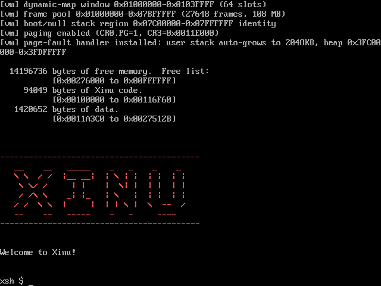

## 验证二：Shift / 大写锁定 / Tab / Ctrl

依次按 Shift+H、i、空格、CapsLock、a b c(变 ABC)、CapsLock、空格、Tab、Ctrl+A，屏幕实时回显 Hi ABC、制表空隙、^A，每个字符即时回显。

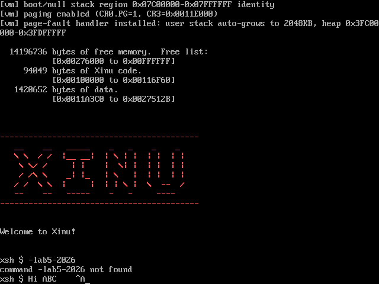

## 验证三：退格键 Backspace / Ctrl+H

输入 Hello WORLD 1@*(WORLD 用大写锁定、@ * 用 Shift)，再按三次退格删除 1@*，最后 Ctrl+A 显示 ^A。

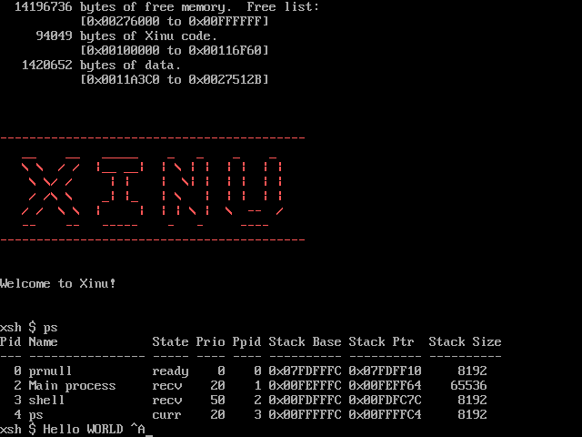

## 验证四：空输入时继续退格不破坏提示符

空白提示符处连按 5 次退格，提示符 xsh $ 不被吃掉；随后输入 ok 紧跟提示符出现。

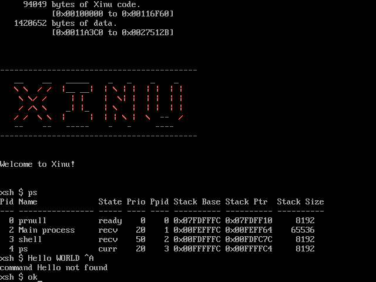

## 验证五：ps 命令运行于 VGA 显示器

ps 的进程表完整渲染在 VGA 上；输出超过一屏时整屏上滚(见验证十一)。

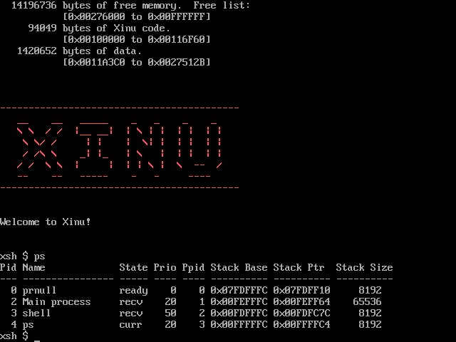

## 验证六：超过一行的输入自动折行

提示符处连续输入 92 个字符，超过 80 列后自动折到下一行，光标随之到第二行。

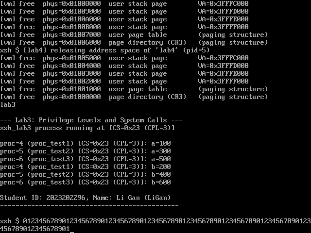

## 验证七：提示符在最后一行时回车上滚

连续回车把提示符推到最后一行后继续回车，屏幕整屏上滚一行、提示符始终停在最后一行可见。

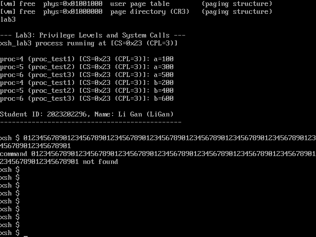

## 验证八：左右光标与行内编辑

输入 2026，按 ← 四次把光标移到行首，再输入 -lab5-，字符被插入到光标处而非追加，得到 -lab5-2026(2026 整体右移)。代码见 Lab5_kbd.c 的 k5_extended 与 k5_redraw_tail。

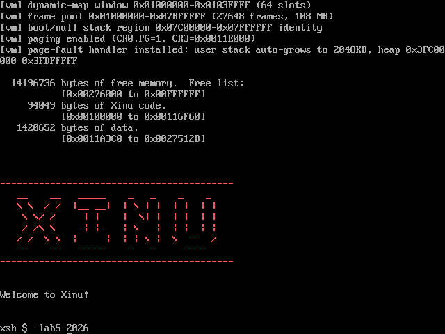

## 验证九：xsh_lab5 运行于分页用户态并查看/释放内存

执行 lab5 foo，输出 CPL=3、局部变量地址 &x、所有参数、学号姓名(拼音)，并 dumpmap 打印内存映射(可见本实验新增的 0xFD000000 帧缓冲段)；进程正常结束后逐页 [vm] free 释放用户栈、页表与页目录(CR3)。

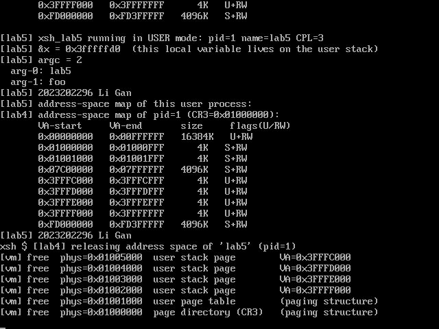

## 验证十：长行 / 符号 / Tab / 回车

执行 lab5 chars：输出数字、大小写字母、各种符号；\t 把字段对齐到制表位；\r 测试 aaaaaaaa\rBBBB 在屏幕上覆盖为 BBBBaaaa；最后 120 列长串在第 80 列折行。

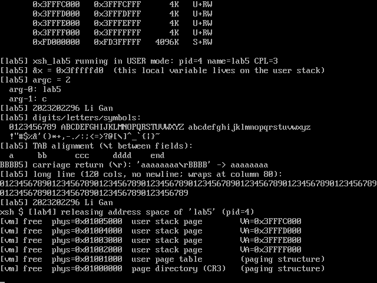

## 验证十一：超过一屏的多行输出与上滚

执行 lab5 scroll：打印 40 行(屏高 30 行)，屏幕逐行上滚，最终停在第 21 至 40 行加结束语加进程释放日志。

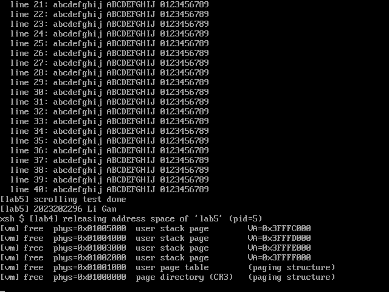

## 验证十二：实验 4 的 lab4 命令在 VGA 上正常运行

执行 lab4 1：分页用户进程 fork 出子进程，父子在同一虚拟地址 0x3fffffa0 下，子进程把 lvar 改成 999 而父进程仍读到 111(地址空间隔离)，结束后地址空间完整释放，全部渲染在 VGA 上。

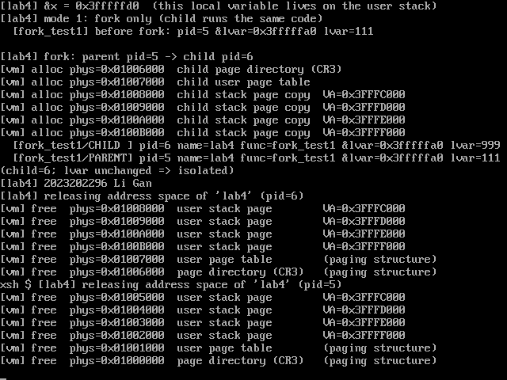

## 验证十三：实验 3 的 lab3 命令在 VGA 上正常运行

执行 lab3：三个用户态子进程均以 CS=0x23(CPL=3) 正确运行，全部显示在 VGA 上。

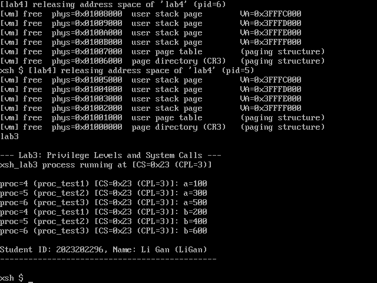
